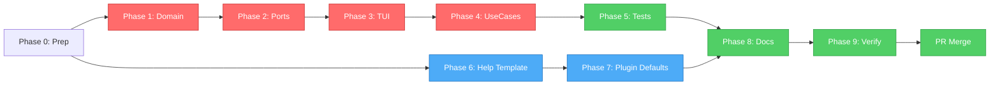

# FEV-14 Todo List — UX Enhancements (v1.2 Phase 4)

**Phase:** FEV-14 (v1.2 Phase 4)
**Issues:** [#47](https://github.com/fisherk2/codice-opencode/issues/47), [#56](https://github.com/fisherk2/codice-opencode/issues/56)
**Spec:** [SPEC.md](../SPEC.md), [docs/WORKFLOW.md](../docs/WORKFLOW.md) §FEV-14
**Date:** 2026-07-29
**Full plan:** [plan.md](./plan.md)
**Status:** 📋 Listo para implementación
**Branch:** `feat/fev14-ux` (from `feat/ux-docs-wiki`)

---

## Decisiones UX Confirmadas (vía question tool)

| # | Pregunta | Decisión |
|---|----------|----------|
| 1 | Estilo de progress bar | **Multi-progress con log lines** (`clack.progress()` per-file + `clack.log()` con eventos) |
| 2 | 6 opciones del menú `/help` | **Onboarding + lifecycle + advanced** (What is Códice? / Start new / Update existing / SDD cycle / List 13 commands / Troubleshooting) |
| 3 | Visibilidad del progress bar | **Siempre visible** (no solo en `--verbose`) |
| 4 | Bump de versión | **Mantener v1.2.0** (sin bump; cierre coordinado FEV-12/13/14/15) |

---

## Phase 0: Preparation

- [ ] **Task 0.1:** Crear rama `feat/fev14-ux` desde `feat/ux-docs-wiki` (o `develop`)
- [ ] **Task 0.2:** Verificar baseline — `just check` + `just test` + `just test:e2e` exit 0

**Checkpoint:** ✅ Branch clean, 761 tests passing, 18/18 E2E

---

## Phase 1: Domain — Progress callback (Pillar A foundation)

- [ ] **Task 1.1:** Crear `src/domain/types/ProgressEvent.ts` con discriminated union (6 variants: `stage_start`, `stage_complete`, `stage_skip`, `commit_start`, `commit_complete`, `error`) + `ProgressCallback` type alias
- [ ] **Task 1.2:** Extender `IFileMergeEngine.execute()` con parámetro `onProgress?: ProgressCallback` (3rd, opcional) → `src/domain/ports/IFileMergeEngine.ts`
- [ ] **Task 1.3:** Implementar emisión de eventos en `FileMergeEngine.execute()` + `safeEmit()` wrapper (try/catch para no romper merge) + tests unitarios para 6 eventos + callback exception → `src/domain/services/FileMergeEngine.ts` + `tests/unit/domain/file-merge-engine.test.ts`

**Checkpoint:** ✅ Domain type-check pasa, 6 eventos emitidos, no regresión, tests nuevos pasan

---

## Phase 2: Application — TUI ports

- [ ] **Task 2.1:** Extender `IUserPrompt` con 4 métodos: `showProgressBar(total, label?)`, `updateProgress(current, filePath)`, `completeProgress()`, `logProgressEvent(message)` → `src/application/ports/IUserPrompt.ts`
- [ ] **Task 2.2:** Tests unitarios mock-based para `IUserPrompt` extended port (3+ casos, verifica contrato del port) → `tests/unit/application/i-user-prompt.test.ts`

**Checkpoint:** ✅ Application type-check pasa, contrato del port verificado, sin imports de domain→application

---

## Phase 3: Infrastructure — ClackPromptsAdapter

- [ ] **Task 3.1:** Implementar `showProgressBar()` con `clack.progress({ max: total, style: "heavy" })` + `updateProgress()` con `progress.advance(1, msg)` + `completeProgress()` con `progress.stop()` → `src/infrastructure/adapters/ClackPromptsAdapter.ts`
- [ ] **Task 3.2:** Implementar `logProgressEvent()` con dispatch por categoría: `commit:` → success ✓, `symlink:` → info 🔗, `gitignore:` → info 📄, `error:` → error ✗, `skip:` → warn ⊘, default → step → `src/infrastructure/adapters/ClackPromptsAdapter.ts`
- [ ] **Task 3.3:** Integration tests para progress rendering (6+ escenarios con mock de clack primitives, captura orden de llamadas) → `tests/integration/adapters/clack-prompts-progress.test.ts`

**Checkpoint:** ✅ Adapter >80% coverage, progress + logs visibles en dry-run, no regresión

---

## Phase 4: Use Cases — Wiring

- [ ] **Task 4.1:** Wire progress callback en `CleanInstallUseCase.execute()` (label "Installing files..." + log events post-merge) + tests integration para eventos capturados → `src/application/use-cases/CleanInstallUseCase.ts` + `tests/integration/use-cases/clean-install.test.ts`
- [ ] **Task 4.2:** Wire progress callback en `ProjectInstallUseCase.execute()` (label "Project install...") + tests integration → `src/application/use-cases/ProjectInstallUseCase.ts` + `tests/integration/use-cases/project-install.test.ts`
- [ ] **Task 4.3:** Wire progress callback en `UpdateWorkspaceUseCase.execute()` (label "Updating files...", spinner separado para version check) + tests integration → `src/application/use-cases/UpdateWorkspaceUseCase.ts` + `tests/integration/use-cases/update-workspace.test.ts`

**Checkpoint:** ✅ 3 use cases con progress visible end-to-end, manual smoke test verde, sin regresión

---

## Phase 5: Tests — Integration + E2E

- [ ] **Task 5.1:** Integration test: progress bar visible en Clean Install con 10 files (10 `stage_complete` events + orden + `commit_start`/`commit_complete`) → `tests/integration/use-cases/progress-flow.test.ts`
- [ ] **Task 5.2:** Integration test: progress events log estructurados (`commit:`, `symlink:`, `gitignore:` capturados) → `tests/integration/use-cases/progress-logs.test.ts`
- [ ] **Task 5.3:** E2E: extender `tests/e2e/01-clean-install.sh` con assertions de `commit:` y `symlink:` en stdout (+10 líneas, preservar 5 assertions originales)

**Checkpoint:** ✅ 3 integration tests + 1 E2E extension pasan, sin regresión en suite completa

---

## Phase 6: Help Command — Template (PARALLEL BRANCH)

- [ ] **Task 6.1:** Crear `template/obligatorio/commands/help.md` con frontmatter `agent: huitzilopochtli` + 6 opciones (What is Códice? / Start new project / Update existing / SDD cycle / List 13 commands / Troubleshooting) + Rules + Suggested Next Step (<100 líneas)

**Checkpoint:** ✅ `commands/help.md` creado, frontmatter correcto, listo para auto-discovery

---

## Phase 7: Help Command — Plugin Defaults

- [ ] **Task 7.1:** Agregar `/help: "huitzilopochtli"` a `COMMAND_AGENT_MAP` → `template/obligatorio/.opencode/plugins/src/defaults.ts` (+2 líneas, comentario `// FEV-14`)
- [ ] **Task 7.2:** Agregar `INTENT_PATTERNS["/help"]` con 15+ keywords EN/ES (help, ayuda, como uso, how to use, what is, que es, show commands, list commands, menu, onboarding, getting started, como empezar, donde empiezo, documentation, docs, manual) → mismo archivo (+16 líneas)
- [ ] **Task 7.3:** Agregar `COMMAND_PHASE_MAP["/help"] = "idle"` (informational, sin progresión SDD) → mismo archivo (+2 líneas)
- [ ] **Task 7.4:** Agregar `PHASE_SUGGESTIONS.idle.huitzilopochtli = "Consider /help to discover available commands, or /spec to start a new project."` → mismo archivo (+2 líneas)
- [ ] **Task 7.5:** Integration test: plugin auto-discovers `/help` (temp dir + mock `help.md`, assert `commandAgentMap["/help"] === "huitzilopochtli"`) → `tests/plugin/integration/help-command-discovery.test.ts`

**Checkpoint:** ✅ /help registrado en 4 default maps, plugin auto-discovery test pasa, sin regresión en plugin tests

---

## Phase 8: Documentation

- [ ] **Task 8.1:** Actualizar Wiki `docs/wiki-source/Commands.md` (Mermaid +/help, table +1 row, Command Details +/help subsection, 12→13 commands count) (+20 líneas)
- [ ] **Task 8.2:** Actualizar `README.md` (Features "12 Slash Commands"→"13 Slash Commands", Mermaid +/help node, Full Cycle table +/help row, nueva sección "## Progress Bar") (+25 líneas, <300 total)
- [ ] **Task 8.3:** Actualizar `docs/WORKFLOW.md` (FEV-14 status "📋 Listo"→"✅ Completo", sección resultados, métricas) (+15 líneas, <300 total)
- [ ] **Task 8.4:** Actualizar `CHANGELOG.md` (FEV-14 entry en sección v1.2.0 - Unreleased, Keep a Changelog format Added) (+15 líneas, <350 total)

**Checkpoint:** ✅ Todos los docs consistentes, sin broken links, FEV-14 marcado completo

---

## Phase 9: Verification & Ship

- [ ] **Task 9.1:** `just check` (Biome + tsc) → 0 errors
- [ ] **Task 9.2:** `bun test tests/` → ~781 tests, 0 fail (761 + ~20 new)
- [ ] **Task 9.3:** `just test:e2e` → 19/19 (18 existing + 1 extended)
- [ ] **Task 9.4:** Coverage report → no regression vs 96.98% lines baseline
- [ ] **Task 9.5:** Code Review 5-ejes by Tezcatlipoca → 0 Critical, report en `docs/diagnosis/fix07-v1.2-phase4-ux.md`
- [ ] **Task 9.6:** Ship Review GO/NO-GO → GO, PR mergeado a `develop`

**Checkpoint:** ✅ Todos DoD items satisfied, FEV-14 cerrado, FEV-15 ready

---

## DoD Checklist — FEV-14

### Functional
- [ ] Issue #47 resuelto: progress bar visible durante Clean, Project, Update install
- [ ] Issue #56 resuelto: `/help` command con 6 opciones
- [ ] Progress muestra: archivo actual, total, %, completion
- [ ] Log events emitidos: `commit:`, `symlink:`, `gitignore:`, `error:`, `skip:`
- [ ] `/help` registrado en COMMAND_AGENT_MAP, INTENT_PATTERNS, COMMAND_PHASE_MAP, PHASE_SUGGESTIONS
- [ ] `/help` offers 6 options vía question tool
- [ ] Plugin auto-discovers `commands/help.md` (Pillar 1, FEV-13)

### Quality
- [ ] `just check`: 0 errors
- [ ] `bun test`: ~781 tests, 0 fail
- [ ] `just test:e2e`: 19/19
- [ ] Coverage: no regression vs 96.98% lines
- [ ] Code review: 0 Critical, 0 Important open

### Documentation
- [ ] Wiki Commands.md: 12 → 13 commands
- [ ] README.md: Features + Mermaid + Full Cycle + Progress Bar section
- [ ] WORKFLOW.md: FEV-14 marked complete
- [ ] CHANGELOG.md: FEV-14 entry
- [ ] No broken internal links

### Process
- [ ] Branch `feat/fev14-ux` from `feat/ux-docs-wiki`
- [ ] Atomic commits con `Co-Authored-By: <Agente> <dev@fisherk2.com>`
- [ ] PR to `develop` con CI green
- [ ] Code review ejecutado (5-ejes by Tezcatlipoca)
- [ ] Ship Review: GO decision
- [ ] No version bump (v1.2.0 al cierre de FEV-12 ✅ + 13 ✅ + 14 + 15)

---

## Resumen de Archivos a Modificar/Crear

### Nuevos archivos (10)
1. `src/domain/types/ProgressEvent.ts` (~40 líneas)
2. `tests/unit/application/i-user-prompt.test.ts` (~80 líneas)
3. `tests/integration/adapters/clack-prompts-progress.test.ts` (~120 líneas)
4. `tests/integration/use-cases/progress-flow.test.ts` (~150 líneas)
5. `tests/integration/use-cases/progress-logs.test.ts` (~100 líneas)
6. `template/obligatorio/commands/help.md` (~85 líneas)
7. `tests/plugin/integration/help-command-discovery.test.ts` (~80 líneas)
8. `docs/diagnosis/fix07-v1.2-phase4-ux.md` (code review report)

### Archivos modificados (10)
1. `src/domain/ports/IFileMergeEngine.ts` (+10 líneas)
2. `src/domain/services/FileMergeEngine.ts` (+30 líneas)
3. `tests/unit/domain/file-merge-engine.test.ts` (+50 líneas)
4. `src/application/ports/IUserPrompt.ts` (+25 líneas)
5. `src/infrastructure/adapters/ClackPromptsAdapter.ts` (+50 líneas)
6. `src/application/use-cases/CleanInstallUseCase.ts` (+30 líneas)
7. `src/application/use-cases/ProjectInstallUseCase.ts` (+30 líneas)
8. `src/application/use-cases/UpdateWorkspaceUseCase.ts` (+30 líneas)
9. `template/obligatorio/.opencode/plugins/src/defaults.ts` (+22 líneas en 4 maps)
10. `tests/integration/use-cases/{clean,project,update}-install.test.ts` (+30 líneas c/u)
11. `tests/e2e/01-clean-install.sh` (+10 líneas)
12. `docs/wiki-source/Commands.md` (+20 líneas)
13. `README.md` (+25 líneas)
14. `docs/WORKFLOW.md` (+15 líneas)
15. `CHANGELOG.md` (+15 líneas)

**Total:** 18 archivos (10 nuevos + 8 modificados, 3 de tests adicionales)

---

## Métricas Esperadas

| Métrica | Baseline (v1.1.3 + FEV-13) | Meta v1.2.0-FEV14 |
|---------|------------------------------|---------------------|
| Tests (pass/fail) | 761 / 0 | ~781 / 0 |
| Comandos SDD | 12 | 13 (+/help) |
| `just check` errores | 0 | 0 |
| `just test:e2e` | 18/18 | 19/19 |
| Coverage (lines) | 96.98% | ≥96.98% |
| Plugin file | 366 líneas | 366 (sin tocar) |
| Issues cerrados | — | #47, #56 |

---

## Dependency Graph (Mermaid)

**Critical path:** Phase 0 → 1 → 2 → 3 → 4 → 5 → 8 → 9 (~15h)
**Parallel branch:** Phase 0 → 6 → 7 → 8 (~3h, agent separado)
**Convergence:** Phase 8 espera ambos branches
**Final gate:** Phase 9 (verificación + ship)

---

## Próximo Paso

Una vez aprobado el plan:
1. **Implementar Phase 0-5** (progress bar) — sequential, ~14h
2. **Parallel:** Phase 6-7 (help command) — puede ser otro agente, ~3h
3. **Convergence:** Phase 8 (docs)
4. **Ship:** Phase 9

**Comando sugerido:** `> Run /build to start Phase 0 (preparation)`

---

**Estimated effort:** 17-20h wall-clock (con paralelización)
**Dependencies:** FEV-13 ✅ cerrado
**Blockers:** Ninguno
**Decision Log:** Ver sección "Decisiones UX Confirmadas" arriba

---

*Última actualización: 2026-07-29 — Moctezuma (Strategic Planner)*
