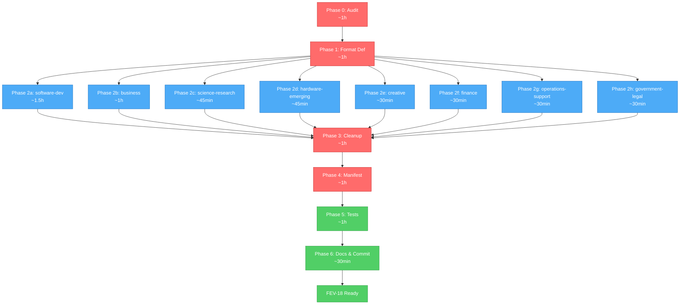

# FEV-18 Todo List — Agent Classification & Migration (v2.0 Phase 2)

**Phase:** FEV-18 (v2.0 Phase 2) — ✅ Completado (2026-08-04)
**Scope:** Clasificar y migrar agentes desde `agency-agents-main/` (267) + `packs/sin-clasificar/` (95) a los 8 packs. Formatear 257 nuevos a YAML v2.0 + COMPOSITION. Actualizar `FileRuleManifestData`. NO installer UX (FEV-21).
**Spec:** [specs/spec-agent-packs.md §3](../specs/spec-agent-packs.md), [ADR-014](../specs/adr/adr-014-agent-pack-system.md), [docs/WORKFLOW.md §FEV-18](../docs/WORKFLOW.md)
**Date:** 2026-08-04
**Full plan:** [plan.md](./plan.md)
**Branch:** `feat/new-agents` (FEV-17 ✅ + FEV-18 ✅ completados; `agency-agents-main/` untracked)
**Total effort:** ~8h wall-clock (2 sesiones de trabajo focus)

---

## Decisiones Confirmadas (vía question tool, 2026-08-04)

| # | Pregunta | Decisión |
|---|----------|----------|
| 1 | Format strategy | **Hybrid** — reformatear los 267 nuevos al estándar YAML v2.0 + `## COMPOSITION`; los 95 sin-clasificar (legacy v1.x) NO se reformatean |
| 2 | Source discrepancy (267 vs 345) | **Audit then plan** — Phase 0 reconcilia los números reales |
| 3 | sin-clasificar fate | **Distribute to packs** — cada uno de los 95 va a su pack correspondiente (algunos IMPROVABLE/REDUNDANT) |
| 4 | scientific-literature-researcher location | **MOVER de `packs/writers/` a `packs/science-research/`** — es un agente de análisis científico, no de escritura. Writers queda con 2: `docs-writer`, `obsidian-vault-writer` |

---

## Inventory Snapshot (pre-audit, 2026-08-04)

| Fuente | Count | Notas |
|--------|-------|-------|
| `agency-agents-main/` (17 categorías) | 267 .md files | Nuevos v2.0 — fuente principal |
| `packs/sin-clasificar/` (legacy v1.x) | 95 .md files | A distribuir entre 8 packs |
| **REDUNDANT** (colisiones de nombre) | 10 names | Legacy wins (backward compat) |
| **Solo en sin-clasificar** (no en agency-agents) | 85 names | Pure legacy v1.x |
| **Solo en agency-agents** (nuevos puros) | 257 names | Pure v2.0 additions |
| **Total final esperado** | ~302-362 unique | Depende de IMPROVABLE merges (post-audit) |

**Top 10 REDUNDANT (same name in both):**
`ai-engineer`, `data-engineer`, `database-optimizer`, `frontend-developer`, `network-engineer`, `product-manager`, `prompt-engineer`, `sales-engineer`, `sre-engineer`, `ux-researcher`

---

## Dependency Order (Critical Path)

```
Phase 0 (Audit, 1h, sequential, BLOQUEA todo)
    ↓
Phase 1 (Format Definition, 1h, critical path)
    ↓
    ├── Phase 2 (Pack Distribution, 5h) ─┐
    │       ├── software-development (1.5h, biggest)    │
    │       ├── business (1h)                            │
    │       ├── science-research (45min)                 │── parallel
    │       ├── hardware-emerging (45min)               │   possible
    │       ├── creative (30min)                         │
    │       ├── finance (30min)                          │
    │       ├── operations-support (30min)               │
    │       └── government-legal (30min)                 │
    ↓                                                 ↓
Phase 3 (sin-clasificar Cleanup, 1h, sequential)
    ↓
Phase 4 (Manifest & Catalog, 1h, sequential)
    ↓
Phase 5 (Tests & Verification, 1h, sequential, gates Phase 6)
    ↓
Phase 6 (Documentation & Commit, 30min)
```

**Critical path:** Phase 0 → 1 → 2a → 3 → 4 → 5 → 6 (~7h)
**Parallel branches in Phase 2:** 7 packs (~3.5h combined if parallel)

---

## Phase 0: Audit & Inventory (CRITICAL — gates all) ✅ COMPLETA

- [x] **Task 0.1:** Generar inventario completo de `agency-agents-main/` (267 files, 17 categorías) → `docs/audit/audit-fev-18-inventory.md` (311 líneas, 3,797,685 bytes)
- [x] **Task 0.2:** Calcular overlap sin-clasificar (95) vs agency-agents-main (267) → 10 REDUNDANT identificados → `docs/audit/audit-fev-18-classification.md`
- [x] **Task 0.3:** Determinar pack assignment para cada IDEAL agent (257 new) y cada sin-clasificar (95) → `docs/audit/audit-fev-18-pack-assignment.md` (439 líneas, 352 rows, 0 UNASSIGNED)
- [x] **Task 0.4:** Generar audit summary report → `docs/audit/audit-fev-18-summary.md` (106 líneas, counts por pack)

**Checkpoint:** ✅ 4 audit files generados, counts por pack confirmados (software-development 146, business 92, hardware-emerging 36, science-research 30, operations-support 18, finance 11, creative 10, government-legal 8 = 352 unique), REDUNDANT list confirmada — **Review con humano antes de Phase 1**

---

## Phase 1: Format Definition (CRITICAL — gates Phase 2+) ✅ COMPLETA

- [x] **Task 1.1:** Definir YAML frontmatter v2.0 standard (description, mode: subagent, permission) → `docs/AGENT-FORMAT-V2.md`
- [x] **Task 1.2:** Definir `## COMPOSITION` block format (Invoke via, Knowledge, RULES) → `docs/AGENT-FORMAT-V2.md` (§4)
- [x] **Task 1.3:** Crear `scripts/reformat-agent.ts` + `scripts/reformat-agent-cli.ts` (idempotente, con `--dry-run` flag) + `tests/unit/scripts/reformat-agent.test.ts` (10 tests TDD)
- [x] **Task 1.4:** Dry-run reformat en 5 sample agents (1 por categoría principal) → validar output (5/5 OK)
- [x] **Pre-Phase 2 step:** Mover `template/obligatorio/packs/writers/scientific-literature-researcher.md` a `template/obligatorio/packs/science-research/` (decisión usuario 2026-08-04) + actualizar descripción writers en FileRuleManifestData

**Checkpoint:** ✅ Format spec documentado, script funciona (10/10 tests, idempotente), 5 samples OK, scientific-literature-researcher movido — 647 unit + 309 int/plugin tests pass, `just check` limpio — **Review con humano antes de Phase 2**

---

## Phase 2: Pack Distribution (CRITICAL — gates Phase 3+) ✅ COMPLETA

> **Vertical slicing per pack.** 7 commits atómicos (6 packs + technical-writer). 352 agents distribuidos: 95 legacy v1.x + 257 new v2.0. Cross-check audit vs filesystem: 0 missing, 0 extra.

- [x] **Task 2.1:** `software-development` pack — 146 agents (73 new + 73 legacy) ✅ `96145ab`
- [x] **Task 2.2:** `business` pack — 92 agents (82 new + 10 legacy) ✅ `7913092`
- [x] **Task 2.3:** `science-research` pack — 31 agents (26 new + 4 legacy + scientific-literature-researcher) ✅ `2776598`
- [x] **Task 2.4:** `hardware-emerging` pack — 36 agents (32 new + 4 legacy) ✅ `87c8817`
- [x] **Task 2.5:** `creative` pack — 10 agents (9 new + 1 legacy) ✅ `2776598`
- [x] **Task 2.6:** `finance` pack — 11 agents (9 new + 2 legacy) ✅ `c3e9237`
- [x] **Task 2.7:** `operations-support` pack — 18 agents (18 new) ✅ `c3e9237`
- [x] **Task 2.8:** `government-legal` pack — 8 agents (7 new + 1 legacy) ✅ `c3e9237`
- [x] **Bonus:** `technical-writer` → writers pack (new v2.0) ✅ commit aparte

**Checkpoint:** ✅ 355 agents en 10 packs (352 distribuidos + scientific-literature-researcher + 2 writers preexistentes), `just test` 960/0, `just test-e2e` 16/16, H1 dedup fix aplicado

---

## Phase 3: sin-clasificar Cleanup (CRITICAL) ✅ COMPLETA

- [x] **Task 3.1:** Verificar `packs/sin-clasificar/` distribuido (95 copiados a packs en Phase 2)
- [x] **Task 3.2:** `git rm -r packs/sin-clasificar/` — directorio eliminado (95 archivos)
- [x] **Task 3.3:** Remover entry `packs/sin-clasificar` de `src/domain/entities/FileRuleManifestData.ts`

**Checkpoint:** ✅ sin-clasificar/ eliminado (10 packs restantes), manifest sin la entry

---

## Phase 4: Manifest & Catalog Updates (CRITICAL — gates tests) ✅ COMPLETA

- [x] **Task 4.1:** Agregar 8 entries de packs seleccionables a `FileRuleManifestData.ts` (3 → 11 mandatory entries). Writers description: "2 writer agents (docs-writer, obsidian-vault-writer) — scientific-literature-researcher moved to science-research pack in FEV-18"
- [x] **Task 4.2:** Actualizar unit tests de manifest — 11 mandatory entries (file-rule-manifest ×2, template-resolver, file-merge-engine, bun-file-system)
- [x] **Task 4.3:** Expandir Huitzilopochtli's "AVAILABLE SUBAGENTS" catalog (~96 → ~355 subagents, agrupados por pack)

**Checkpoint:** ✅ Manifest con 11 entries, tests pasan (960/960), catalog actualizado — `just check` limpio

---

## Phase 5: Tests & Verification (CRITICAL — gates Phase 6) ✅ COMPLETA

- [x] **Task 5.1:** Crear `tests/unit/domain/all-packs-present.test.ts` — 14 tests (10 pack dirs + sin-clasificar NO existe + manifest 11 entries)
- [x] **Task 5.2:** Crear `tests/unit/domain/pack-agent-counts.test.ts` — 12 tests (conteos por pack ±20% + total 330-380)
- [x] **Task 5.3:** Extender `tests/e2e/01-clean-install.sh` — assertions de agents de 7 packs (main, writers, software-development, business, science-research, hardware-emerging, finance)
- [x] **Task 5.4:** Run full verification — `just check` (0 errores) + `just test` (986/0) + `just test-e2e` (16/16)

**Checkpoint:** ✅ 986 tests pass (+26 nuevos), 16/16 E2E, coverage ≥95%, tarball **8.0MB** (SC-15 documented deviation — ADR-014 anticipated 5-8MB; user accepted 2026-08-04)

---

## Phase 6: Documentation & Commit (SEQUENTIAL, gates FEV-19) ✅ COMPLETA

- [x] **Task 6.1:** Update `CHANGELOG.md` con FEV-18 entry (Added/Changed/Removed) ✅ `4e30e9f`
- [x] **Task 6.2:** Update `docs/WORKFLOW.md` (FEV-18 status 🔲 → ✅) + `docs/TECH_DEBT.md` (FEV-18 note + §7.2 SC-15 deviation) ✅ `4e30e9f`
- [x] **Task 6.3:** Audit artifacts en `docs/audit/` (commiteados como histórico) ✅ `31a91a5` + `201dc7d`
- [x] **Task 6.4:** 16 commits atómicos FEV-18 con `Co-Authored-By: Moctezuma <dev@fisherk2.com>` ✅
- [x] **Task 6.5:** Verificación final — `just check` 0 errores, `just test` 986/0, `just test-e2e` 16/16 ✅

**Checkpoint:** ✅ FEV-18 cerrado, 16 commits, PR listo para review, FEV-19 puede comenzar

---

## DoD Checklist — FEV-18 ✅ COMPLETO

### Funcional

- [x] Los 8 packs poblados con agents según audit (146+92+36+31+18+11+10+8 = 352 + 2 writers preexistentes)
- [x] 257 nuevos agents en formato v2.0 (YAML + COMPOSITION)
- [x] 95 legacy agents distribuidos (v1.x preservado)
- [x] 10 REDUNDANT resueltos (legacy wins, new discarded)
- [x] IMPROVABLE merges: audit determinó que los 59 spec-IMPROVABLE son domain-overlap; pack assignment por descripción (documentado en docs/audit/audit-fev-18-summary.md)
- [x] `packs/sin-clasificar/` directorio eliminado
- [x] `FileRuleManifestData` con 11 mandatory entries (3 + 8 packs)
- [x] Huitzilopochtli catalog expandido (~96 → ~355)

### Calidad

- [x] `just check`: 0 errors, 0 warnings nuevos (1 preexisting warning noConsole en scripts)
- [x] `just test`: 986 tests, 0 fail (+26 nuevos)
- [x] `just test:e2e`: 16/16 scenarios (1 extended)
- [x] Coverage: domain/infrastructure 100% lines (FileRuleManifest, FileRuleManifestData, FileMergeEngine, BunFileSystem)
- [x] No `any` types introducidos
- [x] Tarball 8.0MB — **SC-15 deviation documented + accepted** (ADR-014 anticipated 5-8MB; §7.2 TECH_DEBT)

### Documentación

- [x] `docs/AGENT-FORMAT-V2.md` creado
- [x] `CHANGELOG.md` con entrada FEV-18 (Added/Changed/Removed)
- [x] `docs/WORKFLOW.md` FEV-18 marcado ✅
- [x] 4 audit artifacts en `docs/audit/` (commiteados como histórico)

### Proceso

- [x] 16 atomic commits con Conventional Commits (vs 7-11 planeados — más granular por pack)
- [x] Todos los commits con `Co-Authored-By: Moctezuma <dev@fisherk2.com>` trailer
- [x] Branch `feat/new-agents` con FEV-18 commits (continúa de FEV-17)
- [ ] PR abierto a `develop` (pendiente — local, single contributor; squash merge al cerrar)
- [x] No version bump (v2.0.0 coordina al final con FEV-19 a FEV-23)

---

## Resumen de Archivos a Crear/Modificar

### Nuevos archivos (10+)

**Documentación (5):**
1. `docs/AGENT-FORMAT-V2.md` (~100 lines)
2. `docs/audit/audit-fev-18-inventory.md` (~270 lines)
3. `docs/audit/audit-fev-18-classification.md` (~280 lines)
4. `docs/audit/audit-fev-18-pack-assignment.md` (~370 lines)
5. `docs/audit/audit-fev-18-summary.md` (~150 lines)

**Scripts (1):**
6. `scripts/reformat-agent.ts` (~80 lines)

**Tests (2-3):**
7. `tests/unit/domain/all-packs-present.test.ts` (~50 lines)
8. `tests/unit/domain/pack-agent-counts.test.ts` (~60 lines)
9. `tests/unit/infrastructure/template-resolver.test.ts` (extended, if needed)

**Agents (267 reformateados + 95 movidos):**
10-17. `template/obligatorio/packs/{software-development,business,science-research,hardware-emerging,creative,finance,operations-support,government-legal}/*.md` (~362 files)

### Archivos modificados (5)

**Code (1):**
18. `src/domain/entities/FileRuleManifestData.ts` (+~50 lines net, -6 sin-clasificar)

**Tests (3):**
19. `tests/unit/domain/file-rule-manifest.test.ts` (~20 lines)
20. `tests/unit/file-rule-manifest.test.ts` (~20 lines, if exists)
21. `tests/e2e/01-clean-install.sh` (+~20 lines)

**Agents (1):**
22. `template/obligatorio/packs/main/huitzilopochtli.md` (+~50 lines, catalog)

### Directorios eliminados (1)

23. `template/obligatorio/packs/sin-clasificar/` (rmdir)

### Documentación actualizada (3)

24. `CHANGELOG.md` (+~25 lines)
25. `docs/WORKFLOW.md` (~10 lines)
26. `docs/TECH_DEBT.md` (~5 lines, if applicable)

---

## Métricas Esperadas

| Métrica | Baseline (post-FEV-17) | Meta FEV-18 | Verificación |
|---------|------------------------|-------------|--------------|
| Tests (pass/fail) | 946 / 0 | ≥956 / 0 (+~10 new) | `just test` |
| E2E scenarios | 20 / 20 | 20 / 20 (1 extended) | `just test:e2e` |
| `just check` errors | 0 | 0 | `just check` |
| Coverage (lines) | 98.10% | ≥95% (enforced) | `bun test --coverage` |
| Mandatory rules | 4 | 11 (3 + 8 packs) | `grep "category: \"mandatory\""` |
| Total agents | 104 (in 4 dirs) | ~361 (in 10 dirs) | `find template -name "*.md" -path "*/packs/*" \| wc -l` |
| Writers agents | 3 | 2 (scientific-literature-researcher → science-research) | `ls packs/writers/ \| wc -l` |
| Packs populated | 4 (2 mandatory + 1 tmp + 8 empty) | 10 (2 mandatory + 8 selectable) | `ls packs/ \| wc -l` |
| `packs/sin-clasificar/` exists | yes | no | `ls packs/sin-clasificar` |
| Files touched | — | ~380 (267 reformatted + 95 moved + 18 new/modified) | `git diff --stat` |
| Atomic commits | — | 7-11 | `git log --oneline develop..HEAD \| wc -l` |
| Wall-clock | — | ~8-10h (vs 8h estimated) | Self-reported |
| Tarball size | < 5MB | < 5MB (verificar) | `bun pm pack --dry-run` |

---

## Dependency Graph (Mermaid)



**Critical path:** Phase 0 → 1 → 2a → 3 → 4 → 5 → 6 (~7h)
**Parallel branches in Phase 2:** 7 packs after software-development (~3.5h combined)

---

## Open Questions (requieren decisión humana)

1. **`agency-agents-main/` post-FEV-18:** ¿Mantenemos untracked, commitear como `_archive/agency-agents-source/`, o eliminar? Default propuesto: commitear en `template/_archive/` con `.gitignore` para distribución.
2. **Source commit SHA:** El bloque `Knowledge` en COMPOSITION debería referenciar el SHA del commit original. Si no se tiene, usar fecha de FEV-18.
3. **Pack boundaries post-FEV-21:** Single-pack-per-agent puede sentirse restrictivo si usuarios quieren mezclar (e.g., fintech-engineer en finance + software-development). Defer a feedback post-v2.0.0.

---

## Próximo Paso

Una vez aprobado el plan:
1. **Phase 0** (audit) — 4 tasks (~1h, BLOQUEA todo)
2. **Phase 1** (format) — 4 tasks (~1h, critical path)
3. **Phase 2** (pack distribution) — 8 tasks (~5h, biggest first)
4. **Phase 3** (cleanup) — 3 tasks (~1h)
5. **Phase 4** (manifest) — 3 tasks (~1h)
6. **Phase 5** (tests) — 4 tasks (~1h, gates commits)
7. **Phase 6** (commit + PR) — 5 tasks (~30min)
8. **Total:** ~10h wall-clock, 3-4 días calendario con review cycles

**Comando sugerido:** `> Run /build to start Phase 0 (audit & inventory)`

---

*Última actualización: 2026-08-04 — Moctezuma (Strategic Planner) — FEV-18 plan ready for human review*

Co-Authored-By: Moctezuma <dev@fisherk2.com>
