# FEV-21 Todo List — Installer UX: Pack Selection & Version Detection (v2.0 Phase 5)

**Phase:** FEV-21 (v2.0 Phase 5) — 🔲 Planificado
**Scope:** Implementar wizard de selección de packs (8 packs, `software-development` pre-seleccionado, min 1), detección de versión (parseo JSON de `.codice-version` con `version`/`installedPacks`/`installedAt`), version-gated updates (bloquear Update para versiones < 2.0.0 con mensajes específicos por caso), extender `.codice-version` con `installedPacks[]`. Actualizar CleanInstallUseCase, ProjectInstallUseCase, UpdateWorkspaceUseCase (Option A vs Option B), IUserPrompt port (3 nuevos métodos), parse-args (3 nuevos flags), main.ts (version detection antes del mode menu), y 7 nuevos E2E tests.
**Spec:** [specs/spec-installer-ux-v2.md §2-§7](../specs/spec-installer-ux-v2.md), [ADR-015](../specs/adr/adr-015-installer-ux-v2.md)
**Tech Debt:** TD-V2-6 (new — No pack removal mechanism)
**Date:** 2026-08-06
**Author:** Moctezuma (Strategic Planner)
**Full plan:** [plan.md](./plan.md)
**Branch:** `feat/new-agents` (continúa de FEV-20 ✅; usuario confirmó mantener rama)
**Total effort:** ~8h wall-clock (2 días calendario con review)

---

## Decisiones Confirmadas (vía question tool, 2026-08-06)

| # | Pregunta | Decisión |
|---|----------|----------|
| 1 | Pack category strategy | **Nueva categoría `"pack"` en `RuleCategory`** (type-safe, explícito) |
| 2 | Branch strategy | **Continuar en `feat/new-agents`** (consistente con FEV-19/20) |
| 3 | Commit slicing | **Per-file vertical (6-7 commits, FEV-20 style)** — 7 commits atómicos |
| 4 | E2E test scope | **Subset: 7 nuevos E2E (core SCs)** — SC-UX1..SC-UX7; resto a FEV-23 |

---

## Pre-Audit Snapshot (2026-08-06)

### Current `.codice-version` format (v1.x — to be extended)

```json
{
  "installedVersion": "2.0.0",
  "installedAt": "2026-08-05T12:00:00.000Z",
  "optionalSelections": ["scripts/build.sh"]
}
```

### Target `.codice-version` format (v2.0)

```json
{
  "version": "2.0.0",
  "installedPacks": ["software-development", "business"],
  "installedAt": "2026-08-06T12:00:00.000Z",
  "optionalSelections": ["scripts/build.sh"]
}
```

### Files requiring modification (25) + new (7) = 32 total

| Layer | Files | Action |
|-------|-------|--------|
| **Domain** | 4 | `WorkspaceVersion` + `FileRule` + `FileRuleManifestData` + `FileRuleManifest` |
| **Application** | 6 | `IUserPrompt` + `InstallUseCaseBase` + `Clean`/`Project` + `UpdateWorkspace` + `postInstall` |
| **Infrastructure** | 1 | `ClackPromptsAdapter` (3 new methods) |
| **CLI** | 3 | `parse-args` + `main` + `output` |
| **Tests unit** | 2 | `workspace-version.test` + `file-rule-manifest.test` |
| **Tests integration** | 6 | `clack-prompts-adapter` + 3 use case tests + 2 CLI tests |
| **Tests E2E** | 7 new | Scripts 17-23 |
| **Docs** | 3 | `CHANGELOG` + `WORKFLOW` + `TECH_DEBT` |

### Baseline metrics (post-FEV-20)

| Metric | Value |
|--------|------:|
| Tests (pass/fail) | 1747 / 0 |
| E2E scenarios | 16 / 16 |
| `just check` errors | 0 |
| `.codice-version` fields | 3 (`installedVersion`, `installedAt`, `optionalSelections`) |
| FileRule `RuleCategory` values | 3 (`mandatory`, `standard`, `optional`) |
| `IUserPrompt` methods | 12 |
| CLI flags | 7 |

---

## Dependency Order (Critical Path)

```
FEV-20 ✅ (feat/new-agents base)
    ↓
Phase 1: Domain Foundation (1.5h, 1 commit)
    ├── T1.1 WorkspaceVersion.ts (add installedPacks, rename, backward compat) → bundled
    ├── T1.2 FileRule.ts + FileRuleManifestData.ts + FileRuleManifest.ts (pack category + helpers) → bundled
    └── T1.3 Unit tests for WorkspaceVersion + FileRuleManifest → bundled
    ↓
Phase 2: IUserPrompt Port Extension (1.5h, 1 commit)
    ├── T2.1 IUserPrompt.ts (3 new methods) + ClackPromptsAdapter.ts (implementation) → bundled
    └── T2.2 Integration tests for new methods → bundled
    ↓
Phase 3: Install Use Cases (1.5h, 1 commit)
    ├── T3.1 InstallUseCaseBase.ts (add selectPacks phase) → bundled
    ├── T3.2 CleanInstallUseCase.ts + ProjectInstallUseCase.ts (default software-development) → bundled
    ├── T3.3 postInstall.ts (add installedPacks to version file) → bundled
    └── T3.4 Integration tests for clean-install + project-install with packs → bundled
    ↓
Phase 4: Update Mode Rewrite (1.5h, 1 commit)
    ├── T4.1 UpdateWorkspaceUseCase.ts (version gate + Option A/B state machine) → bundled
    └── T4.2 Integration tests for update-workspace with pack scoping → bundled
    ↓
Phase 5: CLI Integration (0.5h, 1 commit)
    ├── T5.1 parse-args.ts (3 new flags) + main.ts (version detection) + output.ts (help text) → bundled
    └── T5.2 Integration tests for parse-args + main → bundled
    ↓
Phase 6: E2E Tests (1h, 1 commit)
    └── T6.1 7 new E2E scripts (17-23) → 1 commit
    ↓
Phase 7: Final Documentation (0.5h, 1 commit)
    └── T7.1 CHANGELOG.md + WORKFLOW.md + TECH_DEBT.md → 1 commit
    ↓
Phase 8: Verification (0.25h, gates FEV-22)
    └── T8.1 just check + just test + just test-e2e
    ↓
FEV-21 Complete → FEV-22 ready
```

**Critical path:** T1.1+T1.2+T1.3 → T2.1+T2.2 → T3.1+T3.2+T3.3+T3.4 → T4.1+T4.2 → T5.1+T5.2 → T6.1 → T7.1 → T8.1 (~8h total)
**Atomic commits:** 7 (1 per phase) + 1 verification (no commit)

---

## Phase 1: Domain Foundation

- [ ] **Task 1.1:** Extend `WorkspaceVersion` entity. Add `installedPacks: readonly string[]` field (4th param, default `[]`). Rename JSON field `installedVersion` → `version`. `fromJSON` accepts both `version` (new) and `installedVersion` (legacy) for backward compat. `toJSON` emits v2.0 format. Commit: `feat(domain): extend WorkspaceVersion with installedPacks and v2.0 format`
- [ ] **Task 1.2:** Add `"pack"` to `RuleCategory` union in `FileRule.ts`. Change 8 entries in `FileRuleManifestData.ts` from `category: "mandatory"` to `category: "pack"`. Add 2 helpers in `FileRuleManifest.ts`: `getPackRules()` returns 8 pack rules; `filterByPacks(rules, selectedPacks)` excludes unselected packs. Commit (bundled): `feat(domain): add pack RuleCategory and filter helpers`
- [ ] **Task 1.3:** Update `tests/unit/domain/workspace-version.test.ts` with 5 new tests (v2.0 format, backward compat, installedPacks validation, toJSON, non-string filtering). Update `tests/unit/file-rule-manifest.test.ts` with 3 new tests (getPackRules returns 8, filterByPacks with selected, filterByPacks with empty). Commit (bundled): `test(domain): cover WorkspaceVersion v2.0 format and pack helpers`

**Checkpoint:** ✅
- [ ] `WorkspaceVersion` accepts 4 params, backward compat works
- [ ] `RuleCategory` includes `"pack"`, 8 manifest entries updated
- [ ] 8 new unit tests pass (5 + 3)
- [ ] `just test-unit` shows 1755+ tests pass
- [ ] **Review con humano antes de Phase 2**

---

## Phase 2: IUserPrompt Port Extension

- [ ] **Task 2.1:** Add 3 type exports to `IUserPrompt.ts`: `PackOption`, `VersionDisplayInfo`, `UpdateOption`/`UpdateOptionChoice`. Add 3 new method signatures: `selectPacks(options, preSelected)`, `showVersionInfo(info)`, `selectUpdateOption(options)`. Implement in `ClackPromptsAdapter.ts`: `selectPacks` uses `clack.multiselect({ required: true })` with locked pack labels; `showVersionInfo` uses `clack.note()` with status-specific message; `selectUpdateOption` uses `clack.select()`. Commit: `feat(adapter): extend IUserPrompt with pack selection, version info, and update options`
- [ ] **Task 2.2:** Add 7 new tests in `clack-prompts-adapter.test.ts`: 3 for `selectPacks` (default selection, cancel, locked label), 2 for `showVersionInfo` (v2.0+ status, missing status), 2 for `selectUpdateOption` (Option A selection, cancel). Commit (bundled): `test(adapter): cover IUserPrompt pack/version/update methods`

**Checkpoint:** ✅
- [ ] `IUserPrompt` extended with 3 new methods + types
- [ ] `ClackPromptsAdapter` implements all 3 methods
- [ ] 7 new adapter tests pass
- [ ] `just test-integration` shows 100% pass
- [ ] **Review con humano antes de Phase 3**

---

## Phase 3: Install Use Cases

- [ ] **Task 3.1:** Update `InstallUseCaseBase.ts`. Add new abstract hook `selectPacks(force: boolean): Promise<readonly string[]>`. Update `execute()` to insert `selectPacks` phase between `confirmOverwrite` and `selectOptionals`. Update `buildRules(selectedPacks, selectedOptionals)` signature (add packs param). Update `runPostInstall` to pass `selectedPacks` to `runPostInstallSteps`. Commit: `feat(usecase): add selectPacks phase to InstallUseCaseBase`
- [ ] **Task 3.2:** Update `CleanInstallUseCase.ts` and `ProjectInstallUseCase.ts`. Override `selectPacks(force)`: `force=true` returns all 8 packs (Clean) or default `[software-development]` (Project); `force=false` shows interactive menu via `userPrompt.selectPacks()`. Override `buildRules(selectedPacks, selectedOptionals)`: apply `filterByPacks` first, then `isRuleSelected` (optionals), then category="mandatory" (Clean only). Commit (bundled): `feat(usecase): CleanInstall and ProjectInstall use pack selection with software-development default`
- [ ] **Task 3.3:** Update `postInstall.ts`. Add `selectedPacks: readonly string[]` to `PostInstallOptions`. Pass `installedPacks: [...selectedPacks]` to `writeVersionFileSafe` (v2.0 format). Commit (bundled): `feat(postinstall): persist installedPacks in .codice-version`
- [ ] **Task 3.4:** Update `tests/integration/use-cases/clean-install.test.ts` and `project-install.test.ts`. Add `selectPacks`, `showVersionInfo`, `selectUpdateOption` to `createMockPrompt`. Add 2 new tests per file: (1) default pack installed when force=true, (2) custom pack selection persisted to version file. Commit (bundled): `test(usecase): cover pack selection in Clean and Project install flows`

**Checkpoint:** ✅
- [ ] `InstallUseCaseBase` has new `selectPacks` phase
- [ ] `Clean`/`Project` use cases override correctly
- [ ] `postInstall.ts` writes `installedPacks` to version file
- [ ] 4+ new integration tests pass
- [ ] **Review con humano antes de Phase 4**

---

## Phase 4: Update Mode Rewrite

- [ ] **Task 4.1:** Refactor `UpdateWorkspaceUseCase.ts`. Add **version gate pre-check**: read `.codice-version` via `WorkspaceVersion.fromJSON`, block if missing or `version < 2.0.0` (show specific warning). Add **Option A vs Option B menu** via `selectUpdateOption`. Add **pack scoping**: Option A merges only `installedPacks`; Option B shows `selectPacks` with installed LOCKED, requires >0 new packs. Add **non-interactive `--update-add-packs`** support via `options.addPacks` param. Persist updated `installedPacks` to version file. Commit: `feat(usecase): UpdateWorkspaceUseCase version gate and Option A/B flow`
- [ ] **Task 4.2:** Update `tests/integration/use-cases/update-workspace.test.ts`. Add `selectPacks`, `showVersionInfo`, `selectUpdateOption` to `createMockPrompt`. Add 6 new tests: (1) blocked when `.codice-version` missing, (2) blocked when version < 2.0.0, (3) allowed when version >= 2.0.0, (4) Option A merges only installedPacks, (5) Option B adds new packs with installed LOCKED, (6) non-interactive `--update-add-packs` works. Commit (bundled): `test(usecase): cover UpdateWorkspaceUseCase version gate and Option A/B`

**Checkpoint:** ✅
- [ ] `UpdateWorkspaceUseCase` reads `.codice-version` via `WorkspaceVersion.fromJSON`
- [ ] Version gate blocks missing and < 2.0.0 with appropriate messages
- [ ] Option A (current packs) and Option B (add packs) work correctly
- [ ] Non-interactive `--update-add-packs` works
- [ ] 6+ new integration tests pass
- [ ] **Review con humano antes de Phase 5**

---

## Phase 5: CLI Integration

- [ ] **Task 5.1:** Update `parse-args.ts`. Add 3 new flags: `--packs <list>` (VALUE_FLAG), `--packs-all` (ALLOWED_FLAG), `--update-add-packs <list>` (VALUE_FLAG). Add `packs`, `packsAll`, `updateAddPacks` to `CliOptions` interface. Update `main.ts`: add `detectVersionContext(fileSystem)` helper, call `userPrompt.showVersionInfo()` before mode menu, add `resolvePacks(options)` helper (--packs-all → all 8, --packs → user list, else default `[software-development]`), pass `packs`/`addPacks` to use cases in `runMode()`. Update `output.ts`: `printHelp()` documents 3 new flags. Commit: `feat(cli): add --packs/--packs-all/--update-add-packs flags and version detection`
- [ ] **Task 5.2:** Update `tests/integration/cli/parse-args.test.ts` with 3 new tests (parses `--packs`, `--packs-all`, `--update-add-packs`). Update `tests/integration/cli/main.test.ts` with 2 new tests (detects v2.0+ installation, detects missing `.codice-version`). Commit (bundled): `test(cli): cover pack flags and version detection`

**Checkpoint:** ✅
- [ ] `parse-args.ts` supports 3 new flags
- [ ] `main.ts` runs version detection before mode menu
- [ ] `runMode()` passes packs/addPacks to use cases
- [ ] `output.ts` help text updated
- [ ] 5+ new CLI tests pass
- [ ] **Review con humano antes de Phase 6**

---

## Phase 6: E2E Tests

- [ ] **Task 6.1:** Create 7 new E2E bash scripts in `tests/e2e/`:
  - `17-pack-selection-default.sh` — Verify `--packs software-development` installs default pack, agents present, `.codice-version` has `installedPacks`
  - `18-pack-selection-custom.sh` — Verify `--packs software-development,business` installs both, no agents from unselected packs
  - `19-pack-validation-min1.sh` — Verify `--packs ""` (empty) fails with exit 2
  - `20-codice-version-installedPacks.sh` — Verify `.codice-version` has v2.0 format `{ version, installedPacks, installedAt, optionalSelections? }`
  - `21-update-blocked-missing.sh` — Verify Update blocked when `.codice-version` missing (warning shown, success exit)
  - `22-update-blocked-v1x.sh` — Verify Update blocked when version < 2.0.0 (warning "pre-2.0.0", success exit)
  - `23-update-option-a.sh` — Verify Update Option A (default) merges only `installedPacks`, no new packs added
  
  Each script uses `common.sh` helpers (`assert_file_exists`, `assert_dir_missing`, `log_pass`, `log_fail`). Commit: `test(e2e): cover pack selection, version detection, and Option A/B for FEV-21`

**Checkpoint:** ✅
- [ ] 7 new E2E scripts created
- [ ] All scripts pass (`just test-e2e` shows 23/23)
- [ ] SC-UX1..SC-UX7 covered
- [ ] SC-UX8..SC-UX12 deferred to FEV-23
- [ ] **Review con humano antes de Phase 7**

---

## Phase 7: Final Documentation

- [ ] **Task 7.1:** Update 3 files: (1) `CHANGELOG.md` — add FEV-21 entry with subsecciones (Added, Tech Debt) and summary; (2) `docs/WORKFLOW.md` — FEV-21 status `🔲 Planificado` → `✅ Completo (2026-08-06)` + expand section with detailed bullets; (3) `docs/TECH_DEBT.md` — add TD-V2-6 (No pack removal mechanism) to v2.0.0 open table. Commit: `docs: FEV-21 changelog, workflow, and tech debt updates (TD-V2-6 added)`

**Checkpoint:** ✅
- [ ] Commits atómicos con Conventional Commits (7 total)
- [ ] Todos los commits con `Co-Authored-By: Moctezuma <dev@fisherk2.com>` trailer
- [ ] Branch `feat/new-agents` ready para PR a `develop`
- [ ] **FEV-21 cierra; FEV-22 (Updater Pack Scoping) puede comenzar**

---

## Phase 8: Verification (CRITICAL — gates FEV-22)

- [ ] **Task 8.1:** Run full verification — `just check` (0 errors) + `just test` (1755+ tests pass, 0 fail) + `just test-e2e` (23/23 scenarios)
- [ ] Manual validation:
  - [ ] `bun run src/cli/main.ts --help` muestra 3 nuevos flags
  - [ ] `bun run src/cli/main.ts --clean --force --packs software-development` ejecuta correctamente
  - [ ] `cat tests/fixtures/workspace/.codice-version` muestra `installedPacks: ["software-development"]`
  - [ ] `grep "category: \"pack\"" src/domain/entities/FileRuleManifestData.ts | wc -l` = 8

**Checkpoint:** ✅
- [ ] `just check` 0 errors
- [ ] `just test` 1755+ tests pass
- [ ] `just test-e2e` 23/23 pass
- [ ] Coverage overall ≥ 95% line
- [ ] **Si algo falla, NO proceder a FEV-22, identificar root cause**

---

## DoD Checklist — FEV-21

### Funcional

- [ ] `WorkspaceVersion` constructor accepts 4 params; `fromJSON` accepts both `version` and `installedVersion` (backward compat)
- [ ] `RuleCategory` includes `"pack"`; 8 pack entries in `FileRuleManifestData` use it
- [ ] `getPackRules()` returns 8 pack rules; `filterByPacks(rules, selectedPacks)` correctly filters
- [ ] `IUserPrompt` extended with `selectPacks`, `showVersionInfo`, `selectUpdateOption`
- [ ] `ClackPromptsAdapter` implements all 3 new methods
- [ ] `InstallUseCaseBase` has `selectPacks` phase; `Clean`/`Project` use cases override with default
- [ ] `UpdateWorkspaceUseCase` has version gate + Option A/B + pack scoping
- [ ] `parse-args.ts` supports `--packs`, `--packs-all`, `--update-add-packs`
- [ ] `main.ts` runs version detection before mode menu
- [ ] `output.ts` help text documents new flags

### Tests

- [ ] 8 new unit tests in workspace-version.test.ts (v2.0 format + backward compat)
- [ ] 3 new unit tests in file-rule-manifest.test.ts (getPackRules + filterByPacks)
- [ ] 7 new adapter tests in clack-prompts-adapter.test.ts (3 methods)
- [ ] 4+ new use case tests in clean-install + project-install + update-workspace tests
- [ ] 5+ new CLI tests in parse-args + main tests
- [ ] 7 new E2E scripts (17-23) covering SC-UX1..SC-UX7
- [ ] 1755+ tests pass, 0 fail (1747 baseline + 8+ new)

### Docs

- [ ] `CHANGELOG.md` entrada FEV-21 con subsecciones (Added, Tech Debt)
- [ ] `docs/WORKFLOW.md` FEV-21 marcado ✅ + sección expandida
- [ ] `docs/TECH_DEBT.md` TD-V2-6 añadido
- [ ] Wiki público: NO sincronizado (deferred a FEV-23)

### Calidad

- [ ] `just check`: 0 errors, 0 warnings nuevos
- [ ] `just test`: 1755+ tests, 0 fail
- [ ] `just test-e2e`: 23/23 scenarios
- [ ] Coverage overall ≥ 95% line (unchanged or +)
- [ ] No `any` types introducidos
- [ ] No nuevos dependencies

### Proceso

- [ ] 7 atomic commits con Conventional Commits format
- [ ] Todos los commits con `Co-Authored-By: Moctezuma <dev@fisherk2.com>` trailer
- [ ] Branch `feat/new-agents` (continúa de FEV-17/18/19/20)
- [ ] PR description documentado
- [ ] No version bump (v2.0.0 coordina al final con FEV-22, FEV-23)

---

## Resumen de Archivos a Crear/Modificar

### Archivos modificados (25)

**Domain (4):**
1. `src/domain/entities/WorkspaceVersion.ts` (+30 / -15)
2. `src/domain/entities/FileRule.ts` (+1)
3. `src/domain/entities/FileRuleManifestData.ts` (8 replacements, ~0 net)
4. `src/domain/entities/FileRuleManifest.ts` (+25)

**Application (6):**
5. `src/application/ports/IUserPrompt.ts` (+50)
6. `src/application/use-cases/InstallUseCaseBase.ts` (+25 / -5)
7. `src/application/use-cases/CleanInstallUseCase.ts` (+15)
8. `src/application/use-cases/ProjectInstallUseCase.ts` (+15)
9. `src/application/postInstall.ts` (+5)
10. `src/application/use-cases/UpdateWorkspaceUseCase.ts` (+100 / -30)

**Infrastructure (1):**
11. `src/infrastructure/adapters/ClackPromptsAdapter.ts` (+80)

**CLI (3):**
12. `src/cli/parse-args.ts` (+40)
13. `src/cli/main.ts` (+40 / -5)
14. `src/cli/output.ts` (+20)

**Tests (8):**
15. `tests/unit/domain/workspace-version.test.ts` (+60 / -20)
16. `tests/unit/file-rule-manifest.test.ts` (+30)
17. `tests/integration/adapters/clack-prompts-adapter.test.ts` (+60)
18. `tests/integration/use-cases/clean-install.test.ts` (+40)
19. `tests/integration/use-cases/project-install.test.ts` (+40)
20. `tests/integration/use-cases/update-workspace.test.ts` (+80 / -10)
21. `tests/integration/cli/parse-args.test.ts` (+40)
22. `tests/integration/cli/main.test.ts` (+30)

**Docs (3):**
23. `CHANGELOG.md` (+30)
24. `docs/WORKFLOW.md` (+15)
25. `docs/TECH_DEBT.md` (+10)

### Archivos NUEVOS (7)

26. `tests/e2e/17-pack-selection-default.sh` (+80)
27. `tests/e2e/18-pack-selection-custom.sh` (+80)
28. `tests/e2e/19-pack-validation-min1.sh` (+60)
29. `tests/e2e/20-codice-version-installedPacks.sh` (+70)
30. `tests/e2e/21-update-blocked-missing.sh` (+50)
31. `tests/e2e/22-update-blocked-v1x.sh` (+60)
32. `tests/e2e/23-update-option-a.sh` (+90)

### Total changes

- **25 files modified + 7 new = 32 total files**
- **+1,182 lines, -85 lines = +1,097 lines net**
- **7 atomic commits + 1 verification** (no commit)

---

## Métricas Esperadas

| Métrica | Baseline (post-FEV-20) | Meta FEV-21 | Verificación |
|---------|------------------------|-------------|--------------|
| Tests (pass/fail) | 1747 / 0 | 1755+ / 0 (net +8 unit +7 adapter +4+ use case +5+ CLI = +24+ tests) | `just test` |
| E2E scenarios | 16 / 16 | 23 / 23 (16 baseline + 7 new) | `just test-e2e` |
| `just check` errors | 0 | 0 | `just check` |
| `just check-plugin` errors | 0 | 0 | `just check-plugin` |
| Coverage (lines) | ≥95% | ≥95% | `bun test --coverage` |
| `.codice-version` fields | 3 | 4 (`version`, `installedPacks`, `installedAt`, `optionalSelections?`) | `grep` schema |
| `RuleCategory` values | 3 | 4 (`mandatory`, `standard`, `optional`, `pack`) | `grep "RuleCategory"` |
| `IUserPrompt` methods | 12 | 15 (+3: selectPacks, showVersionInfo, selectUpdateOption) | `grep` interface |
| CLI flags | 7 | 10 (+3: --packs, --packs-all, --update-add-packs) | `--help` |
| FileRule `category: "pack"` entries | 0 | 8 | `grep` manifest |
| Files touched | — | 25 modified + 7 new = 32 total | `git diff --stat` |
| Atomic commits | — | 7 | `git log --oneline` |
| Wall-clock | — | ~8h | Self-reported |

---

## Dependency Graph (Mermaid)

```mermaid
graph TD
    F20[FEV-20 ✅] --> P1
    P1[Phase 1: Domain<br/>~1.5h<br/>1 commit]:::seq --> CP1
    CP1{Phase 1}:::gate --> P2
    P2[Phase 2: IUserPrompt<br/>~1.5h<br/>1 commit]:::seq --> CP2
    CP2{Phase 2}:::gate --> P3
    P3[Phase 3: Use Cases<br/>~1.5h<br/>1 commit]:::seq --> CP3
    CP3{Phase 3}:::gate --> P4
    P4[Phase 4: Update Mode<br/>~1.5h<br/>1 commit]:::seq --> CP4
    CP4{Phase 4}:::gate --> P5
    P5[Phase 5: CLI<br/>~0.5h<br/>1 commit]:::seq --> CP5
    CP5{Phase 5}:::gate --> P6
    P6[Phase 6: E2E<br/>~1h<br/>1 commit]:::seq --> CP6
    CP6{Phase 6}:::gate --> P7
    P7[Phase 7: Docs<br/>~0.5h<br/>1 commit]:::seq --> CP7
    CP7{Phase 7}:::gate --> V
    V[Phase 8: Verify<br/>~0.25h<br/>no commit]:::seq --> DONE
    DONE[FEV-21 ✅]:::done

    classDef done fill:#51cf66,stroke:#2f9e44,color:#fff
    classDef gate fill:#ffd43b,stroke:#f59f00,color:#000
    classDef seq fill:#e7e7e7,stroke:#666,color:#000
```



---

## Open Questions (decidir durante ejecución)

1. **¿Migración in-place de v1.x `.codice-version` (add `installedPacks: ["software-development"]`)?** → **NO** (ADR-015 línea 116-122: rejected). User must reinstall.
2. **¿Validar pack IDs en `parse-args` (--packs invalid → exit 2)?** → **SÍ** (R4 mitigation). Add validation in `runMode()` or `parseArgs()`.
3. **¿Default selection en Update Option B? (¿pre-select installed packs?)** → **SÍ** (spec §4.3 línea 181). `selectPacks(installedPacks, locked: installed)` → pre-selected.
4. **¿Persistir `optionalSelections` en Update? (¿preservar selecciones del install original?)** → **NO** (Update mode spec §6.1: "Skip opcional entirely"). Update no toca opcionales; limpia el array.
5. **¿Helper para contar agents por pack (PackOption.agentCount)?** → **DEFER** to FEV-22. Por ahora `agentCount: 0` en PackOption. Approximate count is sufficient (spec §10 Q4).

---

## Próximo Paso

Una vez aprobado el plan:
1. **Phase 1** (1 commit, ~1.5h) — Domain Foundation: `WorkspaceVersion` + `FileRule` + `FileRuleManifestData` + 2 unit tests
2. **Phase 2** (1 commit, ~1.5h) — IUserPrompt Port: 3 new methods + adapter implementation + 7 tests
3. **Phase 3** (1 commit, ~1.5h) — Install Use Cases: `InstallUseCaseBase` + `Clean`/`Project` + `postInstall` + 4+ tests
4. **Phase 4** (1 commit, ~1.5h) — Update Mode: `UpdateWorkspaceUseCase` rewrite (version gate + A/B) + 6+ tests
5. **Phase 5** (1 commit, ~0.5h) — CLI Integration: `parse-args` + `main` + `output` + 5+ tests
6. **Phase 6** (1 commit, ~1h) — E2E Tests: 7 new bash scripts
7. **Phase 7** (1 commit, ~0.5h) — Changelog + workflow + tech debt
8. **Phase 8** (verification, ~0.25h) — `just check` + `just test` + `just test-e2e`
9. **Total:** ~8.25h wall-clock, 2 días calendario con review cycles

**Comando sugerido:** `> Run /build to start Phase 1 Task 1.1 (extend WorkspaceVersion with installedPacks and v2.0 format)`

---

*Última actualización: 2026-08-06 — Moctezuma (Strategic Planner) — FEV-21 plan ready for human review*

Co-Authored-By: Moctezuma <dev@fisherk2.com>
