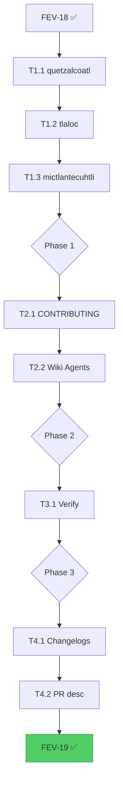

# FEV-19 Todo List — Permission Unification & Subagent Table Removal (v2.0 Phase 3)

**Phase:** FEV-19 (v2.0 Phase 3) — ✅ Completado (2026-08-05)
**Scope:** Unificar permisos `task:` de 4 agentes primarios delegadores a patrón `"*": allow` + deny 5 primarios. **Eliminar TODOS los índices "AVAILABLE SUBAGENTS" de los 6 agentes primarios** (incluyendo el catálogo canónico de huitzilopochtli — expansión de scope). Actualizar `CONTRIBUTING.md` y `docs/wiki-source/Agents.md`.
**Spec:** [specs/spec-agent-packs.md §4](../specs/spec-agent-packs.md), [ADR-014](../specs/adr/adr-014-agent-pack-system.md), [docs/WORKFLOW.md §FEV-19](../docs/WORKFLOW.md)
**Tech Debt:** TD-V2-2, TD-V2-3, TD-V2-4 (✅ cerrados)
**Date:** 2026-08-05
**Author:** Moctezuma (Strategic Planner)
**Full plan:** [plan.md](./plan.md)
**Branch:** `feat/new-agents` (continúa de FEV-17 + FEV-18; usuario confirmó no crear branch nueva)
**Total effort:** ~3h wall-clock (1 día calendario con review)

---

## Decisiones Confirmadas (vía question tool, 2026-08-05)

| # | Pregunta | Decisión |
|---|----------|----------|
| 1 | Scope | **Sí, proceder como planeado** — 3 tech debt items, ~3h |
| 2 | Branch | **Usar branch actual `feat/new-agents`** (no crear nueva) |
| 3 | Slicing | **Per-agent vertical** — 1 commit por agent (3 commits Phase 1) |
| 4 | Tests grep | **No** — validación manual vía code review + `just check` |

---

## Pre-Audit Snapshot (2026-08-05)

### Current `task:` permissions per primary agent

| Agent | `task:` pattern | Explicit allows | Status |
|-------|----------------|-----------------|--------|
| `huitzilopochtli.md` | `"*": allow` + 5 deny | 0 (wildcard) | ✅ **Unificado** (FEV-18) |
| `quetzalcoatl.md` | `"*": deny` + 21 allow | 21 | ❌ Pendiente |
| `tlaloc.md` | `"*": ask` + 73 allow | 73 | ❌ Pendiente |
| `mictlantecuhtli.md` | `"*": deny` + 12 allow | 12 | ❌ Pendiente |
| `moctezuma.md` | `"*": deny` | 0 | ✅ Sin cambios |
| `tezcatlipoca.md` | `"*": deny` | 0 | ✅ Sin cambios |

**Total explicit allows a remover:** 21 + 73 + 12 = **106 entries**.

### "AVAILABLE SUBAGENTS" sections per agent

| Agent | Section exists | Lines | Action |
|-------|----------------|-------|--------|
| `huitzilopochtli.md` | ✅ Yes (canonical) | 52-65 | **KEEP** |
| `quetzalcoatl.md` | ✅ Yes (redundant) | 74-83 | **REMOVE** |
| `tlaloc.md` | ✅ Yes (redundant) | 108-121 | **REMOVE** |
| `mictlantecuhtli.md` | ✅ Yes (redundant) | 47-54 | **REMOVE** |
| `moctezuma.md` | ❌ No | N/A | N/A |
| `tezcatlipoca.md` | ❌ No | N/A | N/A |

---

## Dependency Order (Critical Path)

```
FEV-18 ✅ (feat/new-agents base)
    ↓
Phase 1: Per-Agent Updates (1.5h, sequential)
    ├── T1.1 quetzalcoatl (perm + table + RULES)
    ├── T1.2 tlaloc (perm + table + RULES)
    └── T1.3 mictlantecuhtli (perm + table + RULES)
    ↓
Phase 2: Documentation Updates (0.5h, sequential)
    ├── T2.1 CONTRIBUTING.md (remove step 3, persona updates)
    └── T2.2 Wiki Agents.md (remove step 4, count, perm model)
    ↓
Phase 3: Verification (0.5h, gates Phase 4)
    └── T3.1 just check + just test + just test-e2e
    ↓
Phase 4: Docs & Commit (0.5h, gates FEV-20)
    ├── T4.1 CHANGELOG + WORKFLOW + TECH_DEBT
    └── T4.2 PR description
```

**Critical path:** T1.1 → T1.2 → T1.3 → T2.1 → T2.2 → T3.1 → T4.1 → T4.2 (~3h total)

---

## Phase 1: Per-Agent Updates ✅ COMPLETA

- [x] **Task 1.1:** Unify `quetzalcoatl.md` permissions (`"*": allow` + deny 5 otros primarios incl. tezcatlipoca) + remove "AVAILABLE SUBAGENTS" section (lines 74-83) + update RULES (line 91). Commit: `refactor(agents): unify quetzalcoatl task: permissions and remove redundant subagent catalog`
- [x] **Task 1.2:** Unify `tlaloc.md` permissions (73 entries → `"*": allow` + deny 5 otros primarios incl. tezcatlipoca) + remove "AVAILABLE SUBAGENTS" section (lines 108-121) + update RULES (line 128). Commit: `refactor(agents): unify tlaloc task: permissions and remove redundant subagent catalog (73 entries → 1)`
- [x] **Task 1.3:** Unify `mictlantecuhtli.md` permissions (12 entries → `"*": allow` + deny 5 otros primarios incl. tezcatlipoca) + remove "AVAILABLE SUBAGENTS" section (lines 47-54) + update RULES (line 62). Commit: `refactor(agents): unify mictlantecuhtli task: permissions and remove redundant subagent catalog`
- [x] **Task 1.4 (scope+):** Remove `huitzilopochtli.md` catalog (~355 subagents) — no index in any primary agent. RULES → `agents/` directory. Commit: `refactor(agents): remove huitzilopochtli subagent catalog; reference agents/ directory`
- [x] **Task 1.5 (user edit):** quetzalcoatl RULES wording → "use ANY subagents in `agents/`". Commit: `refactor(agents): reference agents/ directory in quetzalcoatl RULES`

**Checkpoint:** ✅
- [x] 4 agentes con `task: "*": allow` + deny 5 otros primarios (incl. tezcatlipoca, sin self-deny)
- [x] 4 secciones "AVAILABLE SUBAGENTS" eliminadas (quetzalcoatl, tlaloc, mictlantecuhtli, huitzilopochtli)
- [x] 106 explicit allow entries removidos (21 + 73 + 12)
- [x] moctezuma/tezcatlipoca intactos (`task: "*": deny`)
- [x] **Review con humano** — deny-list semantics confirmadas por usuario (no self-deny, deny 5 otros)

---

## Phase 2: Documentation Updates ✅ COMPLETA

- [x] **Task 2.1:** Update `CONTRIBUTING.md` — "Add a New Agent" 5 → 3 steps (remove delegation tables + huitzilopochtli catalog + persona updates). Commit: `docs(contributing): remove delegation table and catalog update steps (FEV-19)`
- [x] **Task 2.2:** Update `docs/wiki-source/Agents.md` — agent count (104 → ~355), file tree (`agents/` → `packs/`), permission model, remove "Step 4: Update Delegation Tables". Commit: `docs(wiki): update Agents.md for unified permissions and pack structure (FEV-19)`
- [x] **Bonus:** README subagent count 98 → 349 (line 160 + features line)

**Checkpoint:** ✅
- [x] `CONTRIBUTING.md` actualizado: 3 steps, sin "persona table updates"
- [x] `docs/wiki-source/Agents.md` actualizado: count, file tree, permission model
- [x] **Review con humano** — docs coherentes con código

---

## Phase 3: Verification ✅ COMPLETA

- [x] **Task 3.1:** Run full verification — `just check` (0 errors) + `just test` (991 tests pass, 0 fail) + `just test-e2e` (16/16 scenarios)
- [x] Manual validation:
  - [x] YAML frontmatter válido en los 4 agentes modificados (verificado por code-reviewer con parser)
  - [x] `grep "AVAILABLE SUBAGENTS" quetzalcoatl.md tlaloc.md mictlantecuhtli.md huitzilopochtli.md` returns 0
  - [x] `grep "catalog" template/obligatorio/packs/main/*.md` returns 0

**Checkpoint:** ✅
- [x] `just check` 0 errors
- [x] `just test` 991 tests pass
- [x] `just test-e2e` 16/16 pass
- [x] Code review (code-reviewer subagent): deny-lists verificados programáticamente, sin self-deny, sin missing denies

---

## Phase 4: Documentation & Commit ✅ COMPLETA

- [x] **Task 4.1:** Update `CHANGELOG.md` (FEV-19 entry) + `docs/WORKFLOW.md` (FEV-19 status ✅) + `docs/TECH_DEBT.md` (close TD-V2-2/3/4) + ADR-014 + spec-agent-packs (amendment). Commit: `docs: FEV-19 changelog, workflow, tech debt, and ADR-014 updates`
- [x] **Task 4.2:** Code review fixes: spec §4.2 deny-list description, README features count, WORKFLOW summary line, SC-P6 scope, SPEC.md progress line

**Checkpoint:** ✅
- [x] Commits atómicos con Conventional Commits (11 total)
- [x] Todos los commits con `Co-Authored-By: Moctezuma <dev@fisherk2.com>` trailer
- [x] Branch `feat/new-agents` ready para PR a `develop`
- [x] **FEV-19 cierra; FEV-20 puede comenzar**

---

## DoD Checklist — FEV-19

### Funcional

- [ ] `quetzalcoatl.md` tiene `task: "*": allow` + 5 deny primaries
- [ ] `tlaloc.md` tiene `task: "*": allow` + 5 deny primaries
- [ ] `mictlantecuhtli.md` tiene `task: "*": allow` + 5 deny primaries
- [ ] 3 secciones "AVAILABLE SUBAGENTS" eliminadas
- [ ] `huitzilopochtli.md` mantiene "AVAILABLE SUBAGENTS" section (canonical)
- [ ] `moctezuma.md` y `tezcatlipoca.md` sin cambios
- [ ] 106 explicit allow entries removidos

### Docs

- [ ] `CONTRIBUTING.md` "Add a New Agent" → 4 steps
- [ ] `CONTRIBUTING.md` "persona table updates" removido
- [ ] `docs/wiki-source/Agents.md` count 104 → ~355
- [ ] `docs/wiki-source/Agents.md` file tree actualizado
- [ ] `docs/wiki-source/Agents.md` permission model actualizado
- [ ] `docs/wiki-source/Agents.md` "Step 4" removido
- [ ] `CHANGELOG.md` entrada FEV-19
- [ ] `docs/WORKFLOW.md` FEV-19 ✅
- [ ] `docs/TECH_DEBT.md` TD-V2-2/3/4 cerradas

### Calidad

- [ ] `just check`: 0 errors, 0 warnings nuevos
- [ ] `just test`: 986+ tests, 0 fail
- [ ] `just test-e2e`: 16/16 scenarios
- [ ] YAML frontmatter válido
- [ ] No `any` types introducidos
- [ ] No nuevos dependencies

### Proceso

- [ ] 6 atomic commits con Conventional Commits
- [ ] Todos los commits con `Co-Authored-By: Moctezuma <dev@fisherk2.com>` trailer
- [ ] Branch `feat/new-agents` (no se crea nueva)
- [ ] PR description documentado
- [ ] No version bump (v2.0.0 coordina al final)

---

## Resumen de Archivos a Crear/Modificar

### Archivos modificados (8)

**Agent files (3):**
1. `template/obligatorio/packs/main/quetzalcoatl.md` (-14 lines)
2. `template/obligatorio/packs/main/tlaloc.md` (-74 lines)
3. `template/obligatorio/packs/main/mictlantecuhtli.md` (-16 lines)

**Doc files (2):**
4. `CONTRIBUTING.md` (-2 lines net)
5. `docs/wiki-source/Agents.md` (-10 lines net)

**Changelog/workflow/tech-debt (3):**
6. `CHANGELOG.md` (+~20 lines)
7. `docs/WORKFLOW.md` (~10 lines modified)
8. `docs/TECH_DEBT.md` (+~10 lines)

### Archivos NO modificados (3 — verificados)

- `template/obligatorio/packs/main/huitzilopochtli.md` (ya unificado en FEV-18)
- `template/obligatorio/packs/main/moctezuma.md` (diseño)
- `template/obligatorio/packs/main/tezcatlipoca.md` (diseño)

### Total changes

- 8 files modified
- +30 lines, -116 lines = **-86 lines net**
- 6 atomic commits

---

## Métricas Esperadas

| Métrica | Baseline (post-FEV-18) | Meta FEV-19 | Verificación |
|---------|------------------------|-------------|--------------|
| Tests (pass/fail) | 986 / 0 | 986 / 0 (sin nuevos) | `just test` |
| E2E scenarios | 16 / 16 | 16 / 16 | `just test-e2e` |
| `just check` errors | 0 | 0 | `just check` |
| Explicit `task:` allow entries | 106 (21+73+12) | 0 | `grep "^\s*\".*\": allow" packs/main/*.md` |
| `AVAILABLE SUBAGENTS` in 3 agents | 3 | 0 | `grep -l "AVAILABLE SUBAGENTS" quetzalcoatl tlaloc mictlantecuhtli` |
| Files touched | — | 8 | `git diff --stat` |
| Atomic commits | — | 6 | `git log --oneline develop..HEAD \| wc -l` |
| Wall-clock | — | ~3h | Self-reported |

---

## Dependency Graph (Mermaid)



---

## Open Questions (decidir durante ejecución)

1. **Self-deny convention:** Huitzilopochtli omite `huitzilopochtli` de su deny list. ¿Aplicar la misma convención a los 3 agents being modified (cada uno se omite a sí mismo)? Decisión propuesta: **SÍ** — auto-deny es defensivo pero redundante; omitir para consistencia.
2. **Backport a v1.2.x:** FEV-19 es breaking (subagentes previously-deny ahora allow). ¿Backport? Decisión propuesta: **NO** — parte de v2.0.0.
3. **Wiki sync timing:** ¿`rsync` a Wiki público en FEV-19 o esperar a v2.0.0 release? Decisión propuesta: **Esperar** — sync en FEV-23 / v2.0.0 release.

---

## Próximo Paso

Una vez aprobado el plan:
1. **Phase 1** (3 commits, ~1.5h) — Per-agent permission unification + table removal
2. **Phase 2** (2 commits, ~0.5h) — Documentation updates
3. **Phase 3** (verification, ~0.5h) — `just check` + `just test` + `just test-e2e`
4. **Phase 4** (1 commit, ~0.5h) — Changelog + workflow + tech debt
5. **Total:** ~3h wall-clock, 1 día calendario con review cycles

**Comando sugerido:** `> Run /build to start Phase 1 Task 1.1 (quetzalcoatl permission + table)`

---

*Última actualización: 2026-08-05 — Moctezuma (Strategic Planner) — FEV-19 plan ready for human review*

Co-Authored-By: Moctezuma <dev@fisherk2.com>
