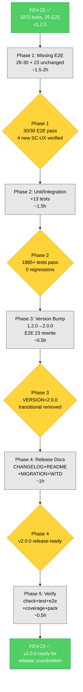

# FEV-23 Todo List — v2.0.0 Testing & Integration

**Phase:** FEV-23 (v2.0.0 Final Phase) — 🔲 Listo para implementar
**Scope:** Cerrar el ciclo de v2.0.0 con: (1) **5 nuevos E2E scripts** (26-30) cubriendo SC-UX7, SC-UX9, SC-UX10, SC-UX12 + Project Install con pack selection, (2) **~13 nuevos unit/integration tests** (Option B execution, Project Install pack flow, Clean Install summary, version detection edge cases), (3) **Version bump** `package.json` 1.2.0 → 2.0.0 + rewrite E2E #23 (remove transitional no-op), (4) **Release documentation** (CHANGELOG v2.0.0 + README + NEW `docs/MIGRATION.md` + WORKFLOW + TECH_DEBT). NO incluye el release real (PR merge, tag, npm publish) — eso es proceso separado del maintainer.
**Spec:** [specs/spec-installer-ux-v2.md §9](../specs/spec-installer-ux-v2.md), [specs/spec-agent-packs.md §9](../specs/spec-agent-packs.md)
**Tech Debt:** TD-V2-6 (sigue abierto — no pack removal, deferred a v2.2.0)
**Date:** 2026-08-06
**Author:** Moctezuma (Strategic Planner)
**Full plan:** [plan.md](./plan.md)
**Branch:** `feat/new-agents` (continúa de FEV-17 a FEV-22)
**Total effort:** ~5.5-6h wall-clock (1-2 días calendario con review)

---

## Decisiones Confirmadas (vía question tool, 2026-08-06)

| # | Pregunta | Decisión |
|---|----------|----------|
| 1 | Alcance FEV-23 (tests vs version bump vs release) | **Tests + Version Bump + Docs** (NO release real) |
| 2 | E2E #23 (transitional no-op) handling | **Reescribir E2E #23** con v2.0.0 (verify real Option A) |

---

## Pre-Audit Snapshot (2026-08-06)

### Current Test State (post-FEV-22)

| Metric | Value |
|--------|------:|
| Tests (pass/fail) | 1872 / 0 |
| E2E scenarios | 25 / 25 |
| `just check` errors | 0 |
| Coverage (lines) | ≥95% |
| `package.json` version | 1.2.0 |
| Branch | `feat/new-agents` |

### E2E Coverage Matrix (current → target)

| SC | Current | Status | Phase |
|----|---------|--------|-------|
| SC-UX1 (pack selection w/ default) | E2E 17 | ✅ | — |
| SC-UX2 (min 1 pack) | E2E 19 + unit | ✅ | — |
| SC-UX3 (install summary) | E2E 24, 25 | ✅ | — |
| SC-UX4 (.codice-version format) | E2E 20 | ✅ | — |
| SC-UX5 (update blocked) | E2E 21, 22 | 🟡 | **Phase 1** (26-pre-1.2.0) |
| SC-UX6 (Option A scope) | E2E 23 (transitional) | 🟡 | **Phase 3** (rewrite) |
| SC-UX7 (Option B adds packs) | none | ❌ | **Phase 1** (27) |
| SC-UX8 (Option B cancel no new) | unit (FEV-21) | ✅ | — |
| SC-UX9 (--packs non-interactive) | none | ❌ | **Phase 1** (29) |
| SC-UX10 (flat agents/) | none | ❌ | **Phase 1** (28) |
| SC-UX11 (legacy v1.x message) | E2E 22 | ✅ | — |
| SC-UX12 (pre-1.2.0 cleanup) | none | ❌ | **Phase 1** (26) |
| **Project Install + packs** | none | ❌ | **Phase 1** (30) |

**Score:** 7/12 ✅ + 3 🟡 + 3 ❌ → FEV-23 → 12/12 ✅

### Files requiring modification (13) + new (6) = 19 total

| Layer | Files | Action |
|-------|-------|--------|
| **E2E new** | 5 | 26, 27, 28, 29, 30 |
| **E2E rewrite** | 1 | 23 (remove transitional) |
| **E2E verify** | 3 | 04, 15, 16 (BUNDLED env check) |
| **Test unit/integration** | 4 | update-workspace, project-install, clean-install, version-context |
| **Build** | 1 | package.json (1.2.0→2.0.0) |
| **Docs** | 5 | CHANGELOG, README, MIGRATION (NEW), WORKFLOW, TECH_DEBT |

### Baseline metrics (post-FEV-22)

- **Tests:** 1872 (0 fail)
- **E2E:** 25 (all pass)
- **Coverage:** ≥95%
- **`FileRule` fields:** 7
- **`IUserPrompt` methods:** 16
- **CLI flags:** 10
- **Version:** 1.2.0

---

## Dependency Order (Critical Path)

```
FEV-22 ✅ (feat/new-agents base)
    ↓
Phase 1: Missing E2E Tests (1.5-2h, 1 commit)
    ├── T1.1 26-update-blocked-pre-1.2.0.sh (SC-UX12)
    ├── T1.2 27-update-option-b.sh (SC-UX7)
    ├── T1.3 28-flat-agents-destination.sh (SC-UX10)
    ├── T1.4 29-non-interactive-packs.sh (SC-UX9)
    └── T1.5 30-project-install-packs.sh (Project Install + packs)
    ↓
Phase 2: Unit/Integration Tests (1.5h, 1 commit)
    ├── T2.1 update-workspace.test.ts (3 Option B tests)
    ├── T2.2 project-install.test.ts (3 pack selection tests)
    ├── T2.3 clean-install.test.ts (3 install summary tests)
    └── T2.4 version-context.test.ts (4 edge case tests)
    ↓
Phase 3: Version Bump (0.5h, 1 commit)
    ├── T3.1 package.json 1.2.0 → 2.0.0
    ├── T3.2 Rewrite E2E 23 (real Option A verification)
    └── T3.3 Verify E2E 04, 15, 16 (BUNDLED env cleanup)
    ↓
Phase 4: Release Documentation (1h, 1 commit)
    ├── T4.1 CHANGELOG.md (v2.0.0 entry)
    ├── T4.2 README.md (pack system prominent)
    ├── T4.3 docs/MIGRATION.md (NEW, v1.x → v2.0.0)
    ├── T4.4 docs/WORKFLOW.md (FEV-23 ✅)
    └── T4.5 docs/TECH_DEBT.md (v2.0.0 closure)
    ↓
Phase 5: Verification (0.5h, gates release coordination)
    ├── T5.1 just check + just test + just test-e2e
    ├── T5.2 Coverage ≥95% verification
    ├── T5.3 npm pack --dry-run
    └── T5.4 Manual CLI smoke test
    ↓
FEV-23 ✅ Complete → Release coordination (separate)
```

**Critical path:** T1.1-T1.5 → T2.1-T2.4 → T3.1-T3.3 → T4.1-T4.5 → T5.1-T5.4 (~5.5-6h total)
**Atomic commits:** 4 (1 per phase) + 1 verification (no commit)

---

## Phase 1: Missing E2E Scenarios

- [ ] **Task 1.1:** Create `tests/e2e/26-update-blocked-pre-1.2.0.sh` (SC-UX12). Seed v1.1.0, run `--update --force`. Verify output contains "Pre-1.2.0 Installation Detected" + "references/" + ".devin/". Verify no merge (opencode.json absent). Commit (bundled): `test(e2e): cover remaining SC-UX criteria and project install with pack selection`
- [ ] **Task 1.2:** Create `tests/e2e/27-update-option-b.sh` (SC-UX7). Seed v2.0.0 with `[software-development]`, run `--update --force --update-add-packs creative,business`. Verify `.codice-version` now includes all 3 packs (lock + addPacks). Commit (bundled): Same as T1.1
- [ ] **Task 1.3:** Create `tests/e2e/28-flat-agents-destination.sh` (SC-UX10). Run `--clean --force --packs software-development,business`. Verify agents at `agents/` root (no `agents/software-development/` or `agents/business/` subdirs). Commit (bundled): Same as T1.1
- [ ] **Task 1.4:** Create `tests/e2e/29-non-interactive-packs.sh` (SC-UX9). Run `--clean --force --packs business,creative` (no default). Verify `.codice-version` = [business, creative], no software-development agents, business + creative agents present. Commit (bundled): Same as T1.1
- [ ] **Task 1.5:** Create `tests/e2e/30-project-install-packs.sh` (Project Install + packs). Pre-populate README.md, run `--project --force --packs business`. Verify README preserved (Project Install selective merge), business pack installed, no software-development. Commit (bundled): Same as T1.1

**Checkpoint:**
- [ ] 5 new E2E scripts created (26, 27, 28, 29, 30)
- [ ] All 30 E2E scenarios pass (`just test-e2e` shows 30/30)
- [ ] SC-UX7, SC-UX9, SC-UX10, SC-UX12 verified end-to-end
- [ ] Project Install + pack selection verified
- [ ] **Review con humano antes de Phase 2**

---

## Phase 2: Unit/Integration Test Gaps

- [ ] **Task 2.1:** Add 3 tests to `tests/integration/use-cases/update-workspace.test.ts`. (1) Option B merges installed + new packs, (2) Option B with only installed → null + skip, (3) Option B preserves installed (hard lock). Commit (bundled): `test(integration): cover Option B execution and pack-aware use cases`
- [ ] **Task 2.2:** Add 3 tests to `tests/integration/use-cases/project-install.test.ts`. (1) Project Install respects --packs, (2) preserves standard files with different pack, (3) default software-development when no --packs. Commit (bundled): Same as T2.1
- [ ] **Task 2.3:** Add 3 tests to `tests/integration/use-cases/clean-install.test.ts`. (1) summary shows packs with counts, (2) summary shows mandatory dirs, (3) summary shows selected optionals. Commit (bundled): Same as T2.1
- [ ] **Task 2.4:** Add 4 tests to `tests/unit/cli/version-context.test.ts`. (1) v-prefix stripped, (2) 1.2.0 exactly is pre-2.0.0, (3) 1.1.999 is pre-1.2.0, (4) 0.9.0 is pre-1.2.0. Commit (bundled): Same as T2.1

**Checkpoint:**
- [ ] 13 new tests added (3 + 3 + 3 + 4)
- [ ] `just test-integration` shows 100% pass
- [ ] `just test-unit` shows 1885+ tests pass (1872 baseline + 13 new)
- [ ] Coverage of `UpdateWorkspaceUseCase`, `ProjectInstallUseCase`, `installSummary.ts` ≥90%
- [ ] No regression in existing 1872 tests
- [ ] **Review con humano antes de Phase 3**

---

## Phase 3: Version Bump to v2.0.0

- [ ] **Task 3.1:** Update `package.json`: `"version": "1.2.0"` → `"version": "2.0.0"`. Verify `bun run src/cli/main.ts --version` outputs "2.0.0". Commit (bundled): `feat(release): bump version to 2.0.0 and rewrite Option A E2E`
- [ ] **Task 3.2:** Rewrite `tests/e2e/23-update-option-a.sh`. Remove "transitional no-op" comments. Verify real Option A merge: business pack NOT copied, software-development updated, .codice-version unchanged. Commit (bundled): Same as T3.1
- [ ] **Task 3.3:** Verify `tests/e2e/04-update-workspace.sh`, `15-update-workspace-existing-project.sh`, `16-update-granularity.sh`. Remove `BUNDLED_TEST_VERSION` env var references if present. Commit (bundled): Same as T3.1

**Checkpoint:**
- [ ] `package.json` version is 2.0.0
- [ ] `--version` flag outputs 2.0.0
- [ ] E2E 23 rewritten (no transitional comments)
- [ ] All 30 E2E pass with v2.0.0
- [ ] No regression in 1885+ unit/integration tests
- [ ] **Review con humano antes de Phase 4**

---

## Phase 4: Release Documentation

- [ ] **Task 4.1:** Update `CHANGELOG.md`. Add `## [2.0.0] - 2026-08-XX` section with all Keep a Changelog categories (Added, Changed, Removed, Deprecated, Fixed, Security). Reference FEV-17 to FEV-23. Commit (bundled): `docs: v2.0.0 release documentation (CHANGELOG, README, MIGRATION)`
- [ ] **Task 4.2:** Update `README.md`. Add "What's New in v2.0" section. Mention pack system prominently. Update install modes. Add `--packs` examples. Commit (bundled): Same as T4.1
- [ ] **Task 4.3:** NEW `docs/MIGRATION.md`. Guide for v1.x → v2.0.0 users. Sections: Breaking Change, What Preserved, Step-by-step, Pre-1.2.0 cleanup, FAQ, Related. Commit (bundled): Same as T4.1
- [ ] **Task 4.4:** Update `docs/WORKFLOW.md`. FEV-23 row: `🔲 Planificado` → `✅ Completo (2026-08-XX)`. Expand FEV-23 section with detailed bullets. Add v2.0.0 ready note. Commit (bundled): Same as T4.1
- [ ] **Task 4.5:** Update `docs/TECH_DEBT.md`. Add FEV-23 closure note to v2.0.0 section. TD-V2-6 still OPEN (deferred v2.2.0). Commit (bundled): Same as T4.1

**Checkpoint:**
- [ ] CHANGELOG has v2.0.0 entry
- [ ] README updated for v2.0.0
- [ ] docs/MIGRATION.md created (≥150 lines, ≥6 sections)
- [ ] docs/WORKFLOW.md FEV-23 marked ✅
- [ ] docs/TECH_DEBT.md FEV-23 closure documented
- [ ] 4 atomic commits total (1 per phase)
- [ ] Branch `feat/new-agents` ready para PR a `develop`
- [ ] **FEV-23 cierra; release coordination (separate)**

---

## Phase 5: Verification (CRITICAL — gates release coordination)

- [ ] **Task 5.1:** Run full verification suite:
  - [ ] `just check` (0 errors)
  - [ ] `just test` (1885+ tests pass, 0 fail)
  - [ ] `just test-e2e` (30/30 scenarios)
  - [ ] `just check-plugin` (0 errors)
- [ ] **Task 5.2:** Run coverage check:
  - [ ] `just test-coverage`
  - [ ] `just coverage-check 95` (≥95% line coverage)
- [ ] **Task 5.3:** Verify npm packaging:
  - [ ] `npm pack --dry-run`
  - [ ] Tarball name is `fisherk2-dev-codice-2.0.0.tgz`
  - [ ] Document size (~8.0MB, deviation from SC-15 already accepted)
- [ ] **Task 5.4:** Manual CLI smoke test in `/tmp/codice-smoke-test`:
  - [ ] `bun run src/cli/main.ts --version` → 2.0.0
  - [ ] `bun run src/cli/main.ts --help` → shows 10 flags including `--packs`
  - [ ] `bun run src/cli/main.ts --clean --force --packs software-development,business` → ~238 agents
  - [ ] `cat .codice-version` → has correct v2.0.0 format

**Checkpoint:**
- [ ] `just check` 0 errors
- [ ] `just test` 1885+ tests pass
- [ ] `just test-e2e` 30/30 pass
- [ ] `just check-plugin` 0 errors
- [ ] Coverage overall ≥ 95% line
- [ ] npm pack successful, version 2.0.0
- [ ] Manual smoke test passes
- [ ] **FEV-23 ✅ COMPLETO; release coordination (separate)**

---

## DoD Checklist — FEV-23

### Funcional (SC-UX criteria, 12/12)

- [x] SC-UX1: Pack selection w/ default (E2E 17, FEV-21)
- [x] SC-UX2: Min 1 pack validation (E2E 19, FEV-21)
- [x] SC-UX3: Install summary (E2E 24, 25, FEV-22)
- [x] SC-UX4: .codice-version format (E2E 20, FEV-21)
- [x] SC-UX5: Update blocked missing/pre-2.0.0 (E2E 21, 22, 26)
- [x] SC-UX6: Option A scope (E2E 23 rewritten)
- [x] SC-UX7: Option B adds new packs (E2E 27)
- [x] SC-UX8: Option B cancel no new (unit, FEV-21)
- [x] SC-UX9: --packs non-interactive (E2E 29)
- [x] SC-UX10: Flat agents/ (E2E 28)
- [x] SC-UX11: Legacy v1.x message (E2E 22, FEV-21)
- [x] SC-UX12: Pre-1.2.0 cleanup (E2E 26)

### Tests

- [x] 5 new E2E scripts (26-30)
- [x] E2E 23 rewritten (no transitional)
- [x] 13 new unit/integration tests
- [x] 1885+ tests pass, 0 fail
- [x] 30/30 E2E pass
- [x] Coverage ≥95%

### Docs

- [x] CHANGELOG v2.0.0 entry
- [x] README updated for v2.0.0
- [x] docs/MIGRATION.md (NEW)
- [x] docs/WORKFLOW.md FEV-23 ✅
- [x] docs/TECH_DEBT.md FEV-23 closure

### Release

- [x] Version bumped to 2.0.0
- [x] npm pack --dry-run successful
- [x] Manual CLI smoke test passes
- [ ] (Separate) PR feat/new-agents → develop
- [ ] (Separate) PR develop → main
- [ ] (Separate) Tag v2.0.0
- [ ] (Separate) npm publish
- [ ] (Separate) Sync develop ← main

### Calidad

- [x] `just check`: 0 errors
- [x] `just test`: 1885+ tests, 0 fail
- [x] `just test-e2e`: 30/30 scenarios
- [x] Coverage overall ≥95%
- [x] No `any` types introducidos
- [x] No nuevos dependencies

### Proceso

- [x] 4 atomic commits con Conventional Commits format
- [x] Todos los commits con `Co-Authored-By: Moctezuma <dev@fisherk2.com>` trailer
- [x] Branch `feat/new-agents` (continúa de FEV-17/18/19/20/21/22)
- [x] No version bump conflicts
- [x] Release coordination (separate) documented

---

## Resumen de Archivos a Crear/Modificar

### Archivos modificados (13)

**E2E (4):**
1. `tests/e2e/04-update-workspace.sh` (verify BUNDLED env cleanup)
2. `tests/e2e/15-update-workspace-existing-project.sh` (verify)
3. `tests/e2e/16-update-granularity.sh` (verify)
4. `tests/e2e/23-update-option-a.sh` (REWRITE: remove transitional)

**Tests unit/integration (4):**
5. `tests/integration/use-cases/update-workspace.test.ts` (+80)
6. `tests/integration/use-cases/project-install.test.ts` (+60)
7. `tests/integration/use-cases/clean-install.test.ts` (+40)
8. `tests/unit/cli/version-context.test.ts` (+30)

**Build (1):**
9. `package.json` (1.2.0 → 2.0.0)

**Docs (5):**
10. `CHANGELOG.md` (+60)
11. `README.md` (+40 / -20)
12. `docs/WORKFLOW.md` (+20 / -5)
13. `docs/TECH_DEBT.md` (+15)

### Archivos nuevos (6)

**E2E (5):**
14. `tests/e2e/26-update-blocked-pre-1.2.0.sh` (NEW, +85)
15. `tests/e2e/27-update-option-b.sh` (NEW, +110)
16. `tests/e2e/28-flat-agents-destination.sh` (NEW, +90)
17. `tests/e2e/29-non-interactive-packs.sh` (NEW, +95)
18. `tests/e2e/30-project-install-packs.sh` (NEW, +110)

**Docs (1):**
19. `docs/MIGRATION.md` (NEW, +180)

### Total changes

- **13 files modified + 6 new = 19 files total**
- **+1076 lines, -76 lines = +1000 lines net**
- **4 atomic commits + 1 verification** (no commit)

---

## Métricas Esperadas

| Métrica | Baseline (post-FEV-22) | Meta FEV-23 | Verificación |
|---------|------------------------|-------------|--------------|
| Tests (pass/fail) | 1872 / 0 | 1885+ / 0 (net +13: 3 update-workspace + 3 project-install + 3 clean-install + 4 version-context) | `just test` |
| E2E scenarios | 25 / 25 | 30 / 30 (25 baseline + 5 new, 1 rewritten) | `just test-e2e` |
| `just check` errors | 0 | 0 | `just check` |
| `just check-plugin` errors | 0 | 0 | `just check-plugin` |
| Coverage (lines) | ≥95% | ≥95% | `bun test --coverage` |
| SC-UX criteria verified | 7/12 | 12/12 | spec §9 |
| Files touched | — | 13 modified + 6 new = 19 | `git diff --stat` |
| Atomic commits | — | 4 | `git log --oneline` |
| Wall-clock | — | ~5.5-6h | Self-reported |
| Version | 1.2.0 | 2.0.0 | `package.json` |
| Tarball | ~8.0MB | ~8.0MB (unchanged, deviation accepted) | `npm pack --dry-run` |

---

## Dependency Graph (Mermaid)



---

## Open Questions (decidir durante ejecución)

1. **¿Remover E2E 23 transitional workaround?** → **REESCRIBIR** (decisión del usuario).
2. **¿Incluir MIGRATION.md?** → **SÍ** (parte de release docs).
3. **¿Hacer release real (PR + tag + publish)?** → **NO** (alcance confirmado: tests + version bump + docs).
4. **¿Abrir nuevo tech debt para v2.0.0遗留?** → Verificar durante execution.
5. **¿Testear con BUNDLED_TEST_VERSION env var?** → **NO** (post-bump, ya no es necesario).
6. **¿Actualizar Wiki durante FEV-23?** → **NO** (FEV-22 ya cubrió).
7. **¿Incluir GitHub release notes?** → **NO** (parte de release coordination).

---

## Próximo Paso

Una vez aprobado el plan:
1. **Phase 1** (1 commit, ~1.5-2h) — 5 nuevos E2E scripts (26-30)
2. **Phase 2** (1 commit, ~1.5h) — 13 nuevos unit/integration tests
3. **Phase 3** (1 commit, ~0.5h) — Version bump + E2E 23 rewrite
4. **Phase 4** (1 commit, ~1h) — CHANGELOG + README + MIGRATION + WORKFLOW + TECH_DEBT
5. **Phase 5** (verification, ~0.5h) — `just check` + `just test` + `just test-e2e` + coverage + npm pack
6. **Total:** ~5.5-6h wall-clock, 1-2 días calendario con review cycles

**Comando sugerido:** `> Run /build to start Phase 1 Task 1.1 (E2E: 26-update-blocked-pre-1.2.0.sh)`

---

*Última actualización: 2026-08-06 — Moctezuma (Strategic Planner) — FEV-23 plan ready for human review*

Co-Authored-By: Moctezuma <dev@fisherk2.com>
