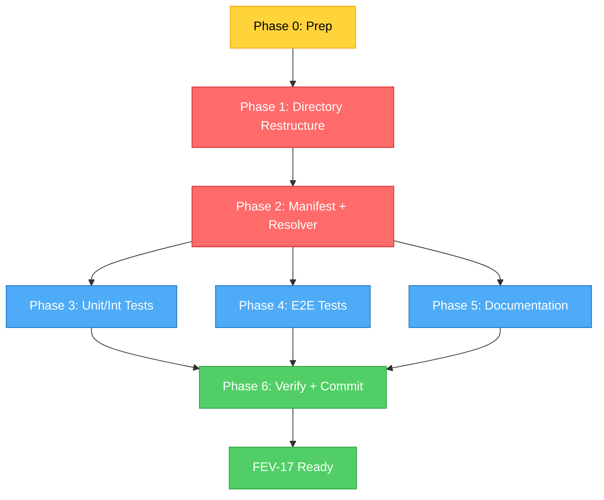

# FEV-17 Todo List — Template Directory Restructuring (v2.0 Phase 1)

**Phase:** FEV-17 (v2.0 Phase 1) — ✅ Completado (2026-08-04)
**Scope:** Restructurar `template/obligatorio/` → `core/` + `packs/`. Actualizar `FileRuleManifestData` + `TemplateResolver`. Path sweep en tests/docs.
**Spec:** [specs/spec-agent-packs.md §2](../specs/spec-agent-packs.md), [ADR-014](../specs/adr/adr-014-agent-pack-system.md), [docs/WORKFLOW.md §FEV-17](../docs/WORKFLOW.md)
**Date:** 2026-08-04
**Full plan:** [plan.md](./plan.md)
**Status:** ✅ Completado — commit `5309c61` (fix: update stale paths and docs after FEV-17 restructure)
**Branch:** `feat/new-agents` (FEV-17 commited; `agency-agents-main/` remains untracked for FEV-18)
**Total effort:** ~7h wall-clock (2-3 días calendario con review) — más que las 4h estimadas en WORKFLOW.md por la cantidad de paths a actualizar.

---

## ✅ FEV-17 Complete — Ready for FEV-18 Planning

FEV-17 está cerrado. Todos los commits aplicados, tests verificados (946 pass, 16/16 E2E, `just check` 0 errores).

### FEV-18 — Agent Classification & Migration (v2.0 Phase 2) — 🔲 Listo para Planeación

**Dependencia:** FEV-17 ✅ completado (satisfecha)
**Spec:** [specs/spec-agent-packs.md §3](../specs/spec-agent-packs.md), [ADR-014](../specs/adr/adr-014-agent-pack-system.md)
**Fuente de agentes:** `agency-agents-main/` (untracked, existente en `feat/new-agents`)
**Esfuerzo estimado:** ~8h

**Scope:**
- Formatear y mover ~345 agentes IDEAL desde `agency-agents-main/` a packs correspondientes
- Fusionar contenido de 59 agentes IMPROVABLE en agentes existentes
- Eliminar 13 agentes REDUNDANT (ya cubiertos por existentes)
- Cada agente: YAML frontmatter estándar + markdown body + bloque Composition

**Resultado esperado:** ~345 agentes clasificados en 8 packs + 2 obligatorios (main, writers).

---

## Decisiones Confirmadas (vía question tool, 2026-08-04)

| # | Pregunta | Decisión |
|---|----------|----------|
| 1 | Alcance FEV-17 | **Restructuring only** — crear core/ + packs/main/ + packs/writers/ + 95 agentes a sin-clasificar/ + 8 packs vacíos. No clasificación manual. |
| 2 | Destino de 95 agentes no-primary/writer | **`packs/sin-clasificar/`** — explícitamente "aún no clasificado" |
| 3 | Git workflow | **Reusar `feat/new-agents`** — agency-agents-main/ queda como recurso no rastreado para FEV-18 |
| 4 | Tests que hardcodean rutas | **Actualizar todas** — 10+ archivos referencian `template/obligatorio/...` |

---

## Estructura Objetivo (v2.0)

```
template/obligatorio/
├── core/                                  # Infraestructura no-agentes
│   ├── .opencode/                         # Plugin, opencode.json
│   ├── commands/                          # 13 CLI commands
│   ├── skills/                            # 51 skills
│   ├── skills-lock.json
│   └── opencode.json
└── packs/
    ├── main/                              # 6 primary agents (MANDATORY)
    ├── writers/                           # 3 writers (MANDATORY)
    ├── sin-clasificar/                    # 95 unclassified (MANDATORY, FEV-18 los distribuirá)
    ├── software-development/              # empty + .gitkeep
    ├── creative/                          # empty + .gitkeep
    ├── business/                          # empty + .gitkeep
    ├── finance/                           # empty + .gitkeep
    ├── government-legal/                  # empty + .gitkeep
    ├── science-research/                  # empty + .gitkeep
    ├── hardware-emerging/                 # empty + .gitkeep
    └── operations-support/                # empty + .gitkeep
```

---

## Dependency Order (Critical Path)

```
Phase 0 (Prep, 15min)
    ↓
Phase 1 (Directory Restructure, 1.5h) ← BLOQUEA Phase 2+
    ↓
Phase 2 (Manifest + Resolver, 1.5h) ← critical path
    ↓
    ├── Phase 3 (Tests, 2h) ─┐
    ├── Phase 4 (E2E, 1h)   ─┼── parallel
    └── Phase 5 (Docs, 30min)┘
    ↓
Phase 6 (Verify + Commit, 30min)
```

**Critical path:** Phase 0 → 1 → 2 → 6 (~5h, longest chain)
**Parallel branches:** Phase 3, 4, 5 (~3.5h combined if solo)

---

## Phase 0: Preparation

- [ ] **Task 0.1:** Verificar baseline — `git -C repo status --short` solo muestra `?? agency-agents-main/`, sin modified. `just check` + `just test` + `just test:e2e` exit 0.
- [ ] **Task 0.2:** Confirmar `template/` limpio — `git -C repo status template/` retorna vacío.

**Checkpoint:** ✅ Branch clean, 910 tests passing, 20/20 E2E

---

## Phase 1: Directory Restructure (CRITICAL — blocks Phase 2+)

- [ ] **Task 1.1:** Crear `core/` y mover 5 infra files (.opencode/, commands/, skills/, opencode.json, skills-lock.json) — 5 git mv operations
- [ ] **Task 1.2:** Crear `packs/` con 11 subdirs (3 con content soon + 8 vacíos con .gitkeep)
- [ ] **Task 1.3:** Mover 6 primary agents (huitzilopochtli, quetzalcoatl, moctezuma, tlaloc, mictlantecuhtli, tezcatlipoca) → `packs/main/`
- [ ] **Task 1.4:** Mover 3 writers (docs-writer, obsidian-vault-writer, scientific-literature-researcher) → `packs/writers/`
- [ ] **Task 1.5:** Mover 95 restantes → `packs/sin-clasificar/` (bulk `git mv *.md`); rmdir `agents/` si vacío
- [ ] **Task 1.6:** Verificar estructura final — `find template/obligatorio/packs -name "*.md" | wc -l` = 104; todos los cambios como renames

**Checkpoint:** ✅ 104 agentes preservados, 8 packs vacíos, `git status` muestra solo renames

---

## Phase 2: FileRuleManifestData + TemplateResolver (CRITICAL — gates Phase 3+)

- [ ] **Task 2.1:** Update `src/domain/entities/FileRuleManifestData.ts` — 7 mandatory entries → 4 (core, packs/main, packs/writers, packs/sin-clasificar)
- [ ] **Task 2.2:** Update `src/infrastructure/adapters/TemplateResolver.ts` — direct resolution para `core/*` y `packs/*`; legacy fallback para `estandar/*` y `opcional/*`
- [ ] **Task 2.3:** Update `tests/unit/domain/file-rule-manifest.test.ts` + `tests/unit/file-rule-manifest.test.ts` — assertions de 7 → 4 mandatory
- [ ] **Task 2.4:** Crear/extend `tests/unit/infrastructure/template-resolver.test.ts` — 10+ casos (v2.0 paths + legacy fallback + security)
- [ ] **Task 2.5:** Verificar baseline Phase 2 — `just check` + `just test:unit` exit 0, sin regresiones

**Checkpoint:** ✅ Manifest + Resolver funcionan, unit tests pasan, coverage ≥95%

---

## Phase 3: Unit/Integration Test Path Updates [PARALLELIZABLE]

- [ ] **Task 3.1:** Update `tests/unit/skill-paths.test.ts` — `SKILLS_DIR` a `core/skills`
- [ ] **Task 3.2:** Update `tests/unit/setup/opencode-config.test.ts` — import path a `core/opencode.json`
- [ ] **Task 3.3:** Update `tests/unit/config/destructive-patterns.test.ts` — 2 paths a `core/.opencode/plugins/...`
- [ ] **Task 3.4:** Update `tests/unit/domain/file-merge-engine.test.ts` — 2 rule paths: `opencode.json`+`agents` → `core`+`packs/main`
- [ ] **Task 3.5:** Update `tests/unit/domain/file-rule-manifest.test.ts` — assertions `agents` → `core`/`packs/main`/`packs/writers`, count 7 → 4
- [ ] **Task 3.6:** Update `tests/unit/domain/services/stagePlanner.test.ts` — 2 rule paths
- [ ] **Task 3.7:** Update `tests/unit/domain/services/file-merge-engine-update.test.ts` — 1 rule path
- [ ] **Task 3.8:** Update `tests/integration/packaging/npm-pack.test.ts` — 6 path assertions (3 in Test A, 3 in Test D) a `core/` + `packs/main/`
- [ ] **Task 3.9:** Audit + update `tests/integration/use-cases/` — 4 files, probable mínimos cambios
- [ ] **Task 3.10:** Update `tests/plugin/integration/` — 4 import paths a `core/.opencode/plugins/src/...`

**Checkpoint:** ✅ 10+ test files actualizados, `just test:unit` + `just test:integration` exit 0

---

## Phase 4: E2E Test Updates [PARALLELIZABLE]

- [ ] **Task 4.1:** Update `tests/e2e/15-update-workspace-existing-project.sh` line 133 — `template/obligatorio/opencode.json` → `core/opencode.json`
- [ ] **Task 4.2:** Audit otros E2E scripts + `common.sh` para path references
- [ ] **Task 4.3:** Run `just test:e2e` — 20/20 scenarios passing, no regression

**Checkpoint:** ✅ 20/20 E2E passing, no path-related failures

---

## Phase 5: Documentation Updates [PARALLELIZABLE]

- [ ] **Task 5.1:** Update `README.md` — references a `template/obligatorio/...`
- [ ] **Task 5.2:** Update `CONTRIBUTING.md` sección "Add a New Agent" — `agents/<name>` → `packs/<pack>/<name>`
- [ ] **Task 5.3:** Update `docs/{WORKFLOW,TECH_DEBT,TRD,ARCHITECTURE}.md` — consistencia con nueva estructura
- [ ] **Task 5.4:** Audit `docs/diagnosis/` — decisión: dejar como histórico o actualizar
- [ ] **Task 5.5:** Update `CHANGELOG.md` — entrada FEV-17 bajo `[Unreleased]`

**Checkpoint:** ✅ Docs consistentes, CHANGELOG actualizado, no broken cross-refs

---

## Phase 6: Verification & Atomic Commits

- [ ] **Task 6.1:** `just check` → 0 errors, 0 warnings nuevos
- [ ] **Task 6.2:** `just test` → ≥910 tests, 0 fail, coverage ≥95%
- [ ] **Task 6.3:** `just test:e2e` → 20/20 scenarios passing
- [ ] **Task 6.4:** 5-6 atomic commits con `Co-Authored-By: Moctezuma <dev@fisherk2.com>`:
  1. `refactor(template)!: restructure to core/ + packs/ directory layout (v2.0)`
  2. `feat(domain): update FileRuleManifestData for v2.0 pack structure`
  3. `feat(infrastructure): TemplateResolver supports core/ + packs/ direct resolution`
  4. `test: update unit + integration tests for v2.0 template paths`
  5. `test(e2e): update E2E tests for v2.0 template paths`
  6. `docs: update documentation for v2.0 template structure`
- [ ] **Task 6.5:** PR to develop (o local merge)

**Checkpoint:** ✅ FEV-17 cerrado, PR listo, FEV-18 puede comenzar

---

## DoD Checklist — FEV-17

### Funcional

- [ ] `template/obligatorio/` contiene solo `core/` + `packs/`
- [ ] 104 agentes preservados (6 main + 3 writers + 95 sin-clasificar)
- [ ] 8 packs vacíos creados (software-development, creative, business, finance, government-legal, science-research, hardware-emerging, operations-support)
- [ ] `FileRuleManifestData` con 4 mandatory entries (no 7)
- [ ] `TemplateResolver` resuelve v2.0 paths + legacy fallback

### Calidad

- [ ] `just check`: 0 errors, 0 warnings nuevos
- [ ] `just test`: ≥910 tests, 0 fail
- [ ] `just test:e2e`: 20/20 scenarios passing
- [ ] Coverage: lines ≥95%, functions ≥95% (enforced)
- [ ] No `any` types introducidos

### Documentación

- [ ] README.md, CONTRIBUTING.md actualizados
- [ ] docs/{WORKFLOW,TECH_DEBT,TRD,ARCHITECTURE}.md consistentes
- [ ] CHANGELOG.md tiene entrada FEV-17
- [ ] Diagnosis docs auditados (decisión: histórico o actualizado)

### Proceso

- [ ] 5-6 atomic commits con Conventional Commits
- [ ] Todos los commits con `Co-Authored-By: Moctezuma <dev@fisherk2.com>` trailer
- [ ] Branch `feat/new-agents` (reusando rama existente)
- [ ] No version bump (v2.0.0 coordina al final con FEV-18 a FEV-23)

---

## Resumen de Archivos a Modificar/Crear

### Nuevos directorios (10)

1. `template/obligatorio/core/` (con 5 infra files movidos)
2-13. `template/obligatorio/packs/{main,writers,sin-clasificar,software-development,creative,business,finance,government-legal,science-research,hardware-emerging,operations-support}/` (3 con agents + 8 vacíos con .gitkeep)

### Directorios eliminados (1)

1. `template/obligatorio/agents/` (rmdir si queda vacío)

### Archivos modificados (16+)

**Code (3):**
1. `src/domain/entities/FileRuleManifestData.ts`
2. `src/infrastructure/adapters/TemplateResolver.ts`
3. `tests/unit/infrastructure/template-resolver.test.ts` (nuevo o extendido)

**Tests (10):**
4-13. 10 archivos de test en `tests/unit/`, `tests/integration/`, `tests/plugin/integration/`

**E2E (1-2):**
14. `tests/e2e/15-update-workspace-existing-project.sh`
15. `tests/e2e/common.sh` (si aplica)

**Documentación (7):**
16-22. README.md, CONTRIBUTING.md, docs/{WORKFLOW,TECH_DEBT,TRD,ARCHITECTURE}.md, CHANGELOG.md

---

## Métricas Esperadas

| Métrica | Baseline (post-FEV-16) | Meta FEV-17 | Verificación |
|---------|------------------------|-------------|--------------|
| Tests (pass/fail) | 910 / 0 | ≥910 / 0 | `just test` |
| E2E scenarios | 20 / 20 | 20 / 20 | `just test:e2e` |
| `just check` errors | 0 | 0 | `just check` |
| Coverage (lines) | 98.10% | ≥95% (enforced) | `bun test --coverage` |
| Mandatory rules | 7 | 4 | `grep "category: \"mandatory\""` |
| Total agents | 104 | 104 (preserved) | `find template -name "*.md" -path "*/packs/*" \| wc -l` |
| Template dirs at root | 6 | 2 | `ls template/obligatorio/` |
| Files touched | — | 25+ | `git diff --stat` |
| Atomic commits | — | 5-6 | `git log --oneline develop..HEAD \| wc -l` |
| Wall-clock | — | ~7-8h (vs 4h estimated) | Self-reported |

---

## Dependency Graph (Mermaid)



**Critical path:** Phase 0 → 1 → 2 → 6 (~5h wall-clock)
**Parallel branches:** Phase 3, 4, 5 (~3.5h combined if solo)

---

## Próximo Paso

Una vez aprobado el plan:
1. **Phase 0** (preparación) — verificar baseline + branch state (~15min)
2. **Phase 1** (directory restructure) — 6 sub-tasks (~1.5h, BLOQUEA Phase 2+)
3. **Phase 2** (manifest + resolver) — 5 sub-tasks (~1.5h, critical path)
4. **Phase 3-5** (tests + docs en paralelo) — 15+ sub-tasks (~3.5h combined)
5. **Phase 6** (verificación + commits) — 5 sub-tasks (~30min)
6. **Total:** ~7-8h wall-clock, 2-3 días calendario con review cycles

**Comando sugerido:** `> Run /build to start Phase 0 (preparation)`

---

*Última actualización: 2026-08-04 — Moctezuma (Strategic Planner) — FEV-17 ready to build*

Co-Authored-By: Moctezuma <dev@fisherk2.com>
