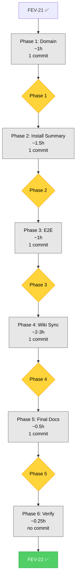

# FEV-22 Todo List — Installer UX Enhancements (v2.0 Phase 6)

**Phase:** FEV-22 (v2.0 Phase 6) — 🔲 Planificado
**Scope:** Implementar los 3 enhancements diferidos del installer UX v2.0: (1) `PackOption.agentCount` per-pack metadata con counts reales, (2) install summary screen (spec §3.3) con `clack.note()` mostrando packs + counts + optionals + total, (3) Wiki sync para reflejar el sistema de packs v2.0. NO toca lógica de Option A/B (ya en FEV-21), NO version bump (v2.0.0 coordina al final con FEV-23).
**Spec:** [specs/spec-installer-ux-v2.md §3.3, §5.2, §10 Q4](../specs/spec-installer-ux-v2.md), [ADR-015](../specs/adr/adr-015-installer-ux-v2.md)
**Tech Debt:** TD-V2-6 (open — no change, deferred to v2.2.0)
**Date:** 2026-08-06
**Author:** Moctezuma (Strategic Planner)
**Full plan:** [plan.md](./plan.md)
**Branch:** `feat/new-agents` (continúa de FEV-21 ✅)
**Total effort:** ~6-7h wall-clock (1-2 días calendario con review)

---

## Decisiones Confirmadas (vía question tool, 2026-08-06)

| # | Pregunta | Decisión |
|---|----------|----------|
| 1 | FEV-22 scope (given FEV-21 implemented most of WORKFLOW.md FEV-22) | **Enhancements diferidos** (agentCount + install summary + wiki sync) |
| 2 | FEV-22 alcance detallado | **agentCount + install summary + wiki sync** (7-8h, scope completo) |
| 3 | Approve plan para escribir a `tasks/plan.md` y `tasks/todo.md` | **Sí, aprobar y guardar** (recomendado) |

---

## Pre-Audit Snapshot (2026-08-06)

### Current `agentCount` (hardcoded to 0)

```typescript
// src/application/packOptions.ts (line 41)
return {
    id,
    name: humanizePackId(id),
    description: rule.description,
    agentCount: 0,  // ← HARDCODED, FEV-22 will read from rule.agentCount
};
```

### Current `FileRule` (no agentCount field)

```typescript
// src/domain/entities/FileRule.ts
export interface FileRule {
    readonly path: string;
    readonly category: RuleCategory;
    readonly isDirectory: boolean;
    readonly description: string;
    readonly noTemplateCopy?: boolean;
    readonly destPath?: string;
    // ❌ NO agentCount field
}
```

### Actual pack counts (verified 2026-08-06)

```
software-development: 146 agents (manifest) / 146 (filesystem)
business:             92 agents (manifest) / 91 (filesystem, -1)
hardware-emerging:    36 agents (manifest) / 36 (filesystem)
science-research:     31 agents (manifest) / 31 (filesystem)
operations-support:   18 agents (manifest) / 18 (filesystem)
finance:              11 agents (manifest) / 11 (filesystem)
creative:             10 agents (manifest) / 10 (filesystem)
government-legal:      8 agents (manifest) /  8 (filesystem)
```

**Note:** Manifest uses approximate counts per spec §10 Q4. `business` differs by 1 (92 vs 91). FEV-22 uses manifest as SSOT.

### Files requiring modification (18) + new (3) = 21 total

| Layer | Files | Action |
|-------|-------|--------|
| **Domain** | 2 | `FileRule` (add field) + `FileRuleManifestData` (populate 8 entries) |
| **Application** | 4 | `packOptions` + `IUserPrompt` + `InstallUseCaseBase` + NEW `installSummary` |
| **Infrastructure** | 1 | `ClackPromptsAdapter` (showInstallSummary implementation) |
| **Tests unit** | 2 | `pack-options.test` (1 updated) + NEW `install-summary.test` |
| **Tests integration** | 3 | `clack-prompts-adapter` + `clean-install` + `project-install` |
| **Tests E2E** | 2 new | Scripts 24-25 |
| **Wiki** | 4 | Home, Getting-Started, Agents, Workspace-Structure |
| **Docs** | 3 | CHANGELOG + WORKFLOW + TECH_DEBT |

### Baseline metrics (post-FEV-21)

| Metric | Value |
|--------|------:|
| Tests (pass/fail) | 1822 / 0 |
| E2E scenarios | 23 / 23 |
| `just check` errors | 0 |
| `FileRule` fields | 6 |
| `IUserPrompt` methods | 15 |
| `agentCount` field on `FileRule` | 0 (no field yet) |
| `agentCount` field on `PackOption` | 0 (hardcoded) |

---

## Dependency Order (Critical Path)

```
FEV-21 ✅ (feat/new-agents base)
    ↓
Phase 1: Domain Extension (1h, 1 commit)
    ├── T1.1 FileRule.ts (add agentCount?) + 8 manifest entries + helper update → bundled
    └── T1.2 Update pack-options unit tests → bundled
    ↓
Phase 2: Install Summary (1.5h, 1 commit)
    ├── T2.1 IUserPrompt.ts (add showInstallSummary + InstallSummaryInfo) + adapter implementation → bundled
    ├── T2.2 installSummary.ts (NEW helper) → bundled
    ├── T2.3 InstallUseCaseBase.ts (add summary phase) → bundled
    └── T2.4 Unit + integration tests → bundled
    ↓
Phase 3: E2E Tests (1h, 1 commit)
    └── T3.1 2 new E2E scripts (24-25) → 1 commit
    ↓
Phase 4: Wiki Sync (2-3h, 1 commit)
    └── T4.1 Update 4 wiki pages + .wiki/ commit → 1 commit
    ↓
Phase 5: Final Documentation (0.5h, 1 commit)
    └── T5.1 CHANGELOG.md + WORKFLOW.md + TECH_DEBT.md → 1 commit
    ↓
Phase 6: Verification (0.25h, gates FEV-23)
    └── T6.1 just check + just test + just test-e2e
    ↓
FEV-22 Complete → FEV-23 ready
```

**Critical path:** T1.1+T1.2 → T2.1+T2.2+T2.3+T2.4 → T3.1 → T4.1 → T5.1 → T6.1 (~6-7h total)
**Atomic commits:** 5 (1 per phase) + 1 verification (no commit)

---

## Phase 1: Domain Foundation

- [ ] **Task 1.1:** Add `agentCount?: number` field to `FileRule` interface in `src/domain/entities/FileRule.ts` with JSDoc (mentions backward compat + spec §10 Q4). Populate `agentCount: N` in 8 pack entries of `src/domain/entities/FileRuleManifestData.ts` (N = 146, 92, 36, 31, 18, 11, 10, 8). Update `src/application/packOptions.ts` line 41: `agentCount: 0` → `agentCount: rule.agentCount ?? 0`. Commit: `feat(domain): add agentCount metadata to FileRule for accurate pack summary`
- [ ] **Task 1.2:** Update `tests/unit/application/pack-options.test.ts`. Replace test "always sets agentCount to 0" (lines 95-116) with 2 tests: (1) "reads agentCount from rule when present", (2) "defaults agentCount to 0 when absent (backward compat)". Commit (bundled): `test(domain): cover agentCount metadata in pack-options helper`

**Checkpoint:** ✅
- [ ] `FileRule.agentCount?: number` field added with JSDoc
- [ ] 8 pack entries in manifest have `agentCount: N`
- [ ] `toPackOptions()` reads from `rule.agentCount ?? 0`
- [ ] 1 unit test updated, 1 new test added (8 total in pack-options.test.ts)
- [ ] `just test-unit` shows 1824+ tests pass (1822 baseline + 2 net)
- [ ] **Review con humano antes de Phase 2**

---

## Phase 2: IUserPrompt Port Extension + Install Summary

- [ ] **Task 2.1:** Add `InstallSummaryInfo` type + `showInstallSummary()` method to `src/application/ports/IUserPrompt.ts`. Add `formatInstallSummary()` import to `src/infrastructure/adapters/ClackPromptsAdapter.ts` and implement method using `clack.note()`. Commit (bundled): `feat(adapter): add IUserPrompt.showInstallSummary for pre-install summary`
- [ ] **Task 2.2:** Create `src/application/installSummary.ts` (NEW, ≤60 lines) with 2 exports: `buildInstallSummary(packRules, selectedPacks, selectedOptionals, allRules): InstallSummaryInfo` (aggregates agent counts + computes totals) and `formatInstallSummary(info): string` (multi-line text for `clack.note()`). Commit (bundled): Same as T2.1
- [ ] **Task 2.3:** Update `src/application/use-cases/InstallUseCaseBase.ts`. Insert new phase between `buildRules` (line 96) and `mergeEngine.execute` (line 101). Call `userPrompt.showInstallSummary(buildInstallSummary(...))`. Add 2 imports (`FILE_RULE_MANIFEST, getPackRules` + `buildInstallSummary`). If file exceeds 200 lines, extract summary phase to private method `private showSummary(rules, packs, optionals)`. Commit (bundled): Same as T2.1
- [ ] **Task 2.4:** Add tests: (1) NEW `tests/unit/application/install-summary.test.ts` with 4+ unit tests for `buildInstallSummary` + `formatInstallSummary`; (2) add 2-3 tests to `clack-prompts-adapter.test.ts` for `showInstallSummary()`; (3) add 1 test to `clean-install.test.ts` and 1 to `project-install.test.ts` verifying summary shown. Commit (bundled): `test(adapter): cover install summary helper and port method`

**Checkpoint:** ✅
- [ ] `IUserPrompt.showInstallSummary()` + `InstallSummaryInfo` type added
- [ ] `installSummary.ts` helper created with 2 exports
- [ ] `InstallUseCaseBase` shows summary between `buildRules` and `merge`
- [ ] `ClackPromptsAdapter.showInstallSummary()` implemented via `clack.note()`
- [ ] 8+ new tests pass (4 unit + 2 adapter + 1 clean + 1 project)
- [ ] `just test-integration` shows 100% pass
- [ ] `just test-unit` shows 1830+ tests pass (1824 baseline + 6+ new unit)
- [ ] **Review con humano antes de Phase 3**

---

## Phase 3: E2E Tests

- [ ] **Task 3.1:** Create 2 new E2E bash scripts in `tests/e2e/`:
  - `24-install-summary-clean.sh` — Verify Clean Install muestra el summary (assert_output_contains "📋 Installation Summary" + "software-development (146 agents)" + "Total: ~238 agents" con `--packs software-development,business`)
  - `25-install-summary-packs.sh` — Verify count accuracy (manifest count matches summary + filesystem count in expected range)
  
  Each script uses `common.sh` helpers (`assert_output_contains`, `setup_workspace`, `log_pass`). Commit: `test(e2e): cover install summary display and count accuracy`

**Checkpoint:** ✅
- [ ] 2 new E2E scripts created
- [ ] All 25 E2E scenarios pass (`just test-e2e` shows 25/25)
- [ ] SC-UX3 (installation summary) verified end-to-end
- [ ] **Review con humano antes de Phase 4**

---

## Phase 4: Wiki Sync

- [ ] **Task 4.1:** Update 4 wiki pages in `docs/wiki-source/`:
  - `Home.md` — Update agent count 98 → ~355, mention "10 packs (2 mandatory + 8 selectable)"
  - `Getting-Started.md` — Add mention of pack selection wizard + install summary in Clean Install section
  - `Agents.md` — Add pack distribution table with counts (146, 92, 36, 31, 18, 11, 10, 8, 6, 4)
  - `Workspace-Structure.md` — Mention `packs/` source + flat `agents/` destination
  
  Sync to .wiki/ repo:
  ```bash
  rsync -a --delete --exclude='README.md' docs/wiki-source/*.md docs/wiki-source/.wiki/
  cd docs/wiki-source/.wiki
  git add .
  git commit -m "Sync wiki for FEV-22 (agentCount metadata + install summary)"
  git push
  ```
  Commit: `docs(wiki): sync v2.0 pack system and install summary to public wiki`

**Checkpoint:** ✅
- [ ] 4 wiki pages updated
- [ ] .wiki/ repo synced and pushed
- [ ] Public wiki reflects v2.0 pack system
- [ ] **Review con humano antes de Phase 5**

---

## Phase 5: Final Documentation

- [ ] **Task 5.1:** Update 3 files: (1) `CHANGELOG.md` — add FEV-22 entry under `[Unreleased]` → `### Added` with summary of changes; (2) `docs/WORKFLOW.md` — FEV-22 status `🔲 Planificado` → `✅ Completo (2026-08-06)` + expand section with detailed bullets; (3) `docs/TECH_DEBT.md` — add FEV-22 closure note to v2.0.0 section. Commit: `docs: FEV-22 changelog, workflow, and tech debt updates`

**Checkpoint:** ✅
- [ ] Commits atómicos con Conventional Commits (5 total)
- [ ] Todos los commits con `Co-Authored-By: Moctezuma <dev@fisherk2.com>` trailer
- [ ] Branch `feat/new-agents` ready para PR a `develop`
- [ ] **FEV-22 cierra; FEV-23 (Testing & Integration) puede comenzar**

---

## Phase 6: Verification (CRITICAL — gates FEV-23)

- [ ] **Task 6.1:** Run full verification — `just check` (0 errors) + `just test` (1830+ tests pass, 0 fail) + `just test-e2e` (25/25 scenarios)
- [ ] Manual validation:
  - [ ] `bun run src/cli/main.ts --help` shows 10 flags (no new flags in FEV-22)
  - [ ] `bun run src/cli/main.ts --clean --force --packs software-development,business` shows install summary with "(238 agents)"
  - [ ] `grep "agentCount:" src/domain/entities/FileRuleManifestData.ts | wc -l` = 8
  - [ ] `git -C docs/wiki-source/.wiki log -1` shows new wiki commit

**Checkpoint:** ✅
- [ ] `just check` 0 errors
- [ ] `just test` 1830+ tests pass
- [ ] `just test-e2e` 25/25 pass
- [ ] Coverage overall ≥ 95% line
- [ ] **Si algo falla, NO proceder a FEV-23, identificar root cause**

---

## DoD Checklist — FEV-22

### Funcional

- [ ] `FileRule.agentCount?: number` field added with JSDoc
- [ ] 8 pack entries in `FileRuleManifestData` have `agentCount: N` (146, 92, 36, 31, 18, 11, 10, 8)
- [ ] `toPackOptions()` reads from `rule.agentCount ?? 0` (backward compat)
- [ ] `IUserPrompt.showInstallSummary()` + `InstallSummaryInfo` type added
- [ ] `ClackPromptsAdapter.showInstallSummary()` implemented via `clack.note()`
- [ ] `installSummary.ts` helper with 2 exports (`buildInstallSummary`, `formatInstallSummary`)
- [ ] `InstallUseCaseBase` shows summary between `buildRules` and `merge`
- [ ] Wiki 4 pages updated + .wiki/ repo synced

### Tests

- [ ] 1 unit test updated in `pack-options.test.ts` (hardcoded 0 → reads from rule)
- [ ] 1 new unit test in `pack-options.test.ts` (defaults to 0 when absent)
- [ ] 4+ new unit tests in `install-summary.test.ts`
- [ ] 2-3 new adapter tests in `clack-prompts-adapter.test.ts`
- [ ] 1 new test in `clean-install.test.ts` (summary shown)
- [ ] 1 new test in `project-install.test.ts` (summary shown)
- [ ] 2 new E2E scripts (24-25)
- [ ] 1830+ tests pass, 0 fail (1822 baseline + 8+ new)

### Docs

- [ ] `CHANGELOG.md` FEV-22 entry with subsecciones (Added)
- [ ] `docs/WORKFLOW.md` FEV-22 marked ✅ + section expanded
- [ ] `docs/TECH_DEBT.md` FEV-22 closure documented
- [ ] Wiki 4 pages updated + .wiki/ repo synced and pushed
- [ ] No version bump (v2.0.0 coordina al final con FEV-23)

### Calidad

- [ ] `just check`: 0 errors, 0 warnings nuevos
- [ ] `just test`: 1830+ tests, 0 fail
- [ ] `just test-e2e`: 25/25 scenarios
- [ ] Coverage overall ≥ 95% line (unchanged or +)
- [ ] No `any` types introducidos
- [ ] No nuevos dependencies

### Proceso

- [ ] 5 atomic commits con Conventional Commits format
- [ ] Todos los commits con `Co-Authored-By: Moctezuma <dev@fisherk2.com>` trailer
- [ ] Branch `feat/new-agents` (continúa de FEV-17/18/19/20/21)
- [ ] PR description documentado
- [ ] No version bump (v2.0.0 coordina al final con FEV-23)

---

## Resumen de Archivos a Crear/Modificar

### Archivos modificados (18)

**Domain (2):**
1. `src/domain/entities/FileRule.ts` (+3)
2. `src/domain/entities/FileRuleManifestData.ts` (+8)

**Application (4):**
3. `src/application/packOptions.ts` (+1 / -1)
4. `src/application/ports/IUserPrompt.ts` (+20)
5. `src/application/use-cases/InstallUseCaseBase.ts` (+12)
6. `src/application/installSummary.ts` (NEW, +35)

**Infrastructure (1):**
7. `src/infrastructure/adapters/ClackPromptsAdapter.ts` (+5)

**Tests unit (3):**
8. `tests/unit/application/pack-options.test.ts` (+10 / -8)
9. `tests/unit/application/install-summary.test.ts` (NEW, +60)
10. `tests/integration/adapters/clack-prompts-adapter.test.ts` (+30)
11. `tests/integration/use-cases/clean-install.test.ts` (+20)
12. `tests/integration/use-cases/project-install.test.ts` (+20)

**E2E (2):**
13. `tests/e2e/24-install-summary-clean.sh` (NEW, +70)
14. `tests/e2e/25-install-summary-packs.sh` (NEW, +70)

**Wiki (4):**
15. `docs/wiki-source/Home.md` (+15 / -10)
16. `docs/wiki-source/Getting-Started.md` (+20 / -10)
17. `docs/wiki-source/Agents.md` (+20 / -15)
18. `docs/wiki-source/Workspace-Structure.md` (+15 / -10)

**Docs (3):**
19. `CHANGELOG.md` (+25)
20. `docs/WORKFLOW.md` (+10 / -5)
21. `docs/TECH_DEBT.md` (+5)

### Total changes

- **18 files modified + 3 new = 21 files total**
- **+461 lines, -59 lines = +402 lines net**
- **5 atomic commits + 1 verification** (no commit)

---

## Métricas Esperadas

| Métrica | Baseline (post-FEV-21) | Meta FEV-22 | Verificación |
|---------|------------------------|-------------|--------------|
| Tests (pass/fail) | 1822 / 0 | 1830+ / 0 (net +8: 1 unit updated, 1 new unit, 4 helper, 2 adapter, 1 clean, 1 project) | `just test` |
| E2E scenarios | 23 / 23 | 25 / 25 (23 baseline + 2 new) | `just test-e2e` |
| `just check` errors | 0 | 0 | `just check` |
| `just check-plugin` errors | 0 | 0 | `just check-plugin` |
| Coverage (lines) | ≥95% | ≥95% | `bun test --coverage` |
| `FileRule` fields | 6 | 7 (+1 `agentCount?`) | `grep "readonly" FileRule.ts` |
| `IUserPrompt` methods | 15 | 16 (+1 `showInstallSummary`) | `grep` interface |
| Wiki pages synced | 0 (deferred) | 4 (Home, Getting-Started, Agents, Workspace-Structure) | `git -C .wiki log` |
| Files touched | — | 18 modified + 3 new = 21 total | `git diff --stat` |
| Atomic commits | — | 5 | `git log --oneline` |
| Wall-clock | — | ~6-7h | Self-reported |

---

## Dependency Graph (Mermaid)



---

## Open Questions (decidir durante ejecución)

1. **¿Validar que el `agentCount` del manifest coincide con filesystem count real?** → **NO** (spec §10 Q4: "approximate sufficient"). Manifest es SSOT. Si exact count es requerido, deferred a FEV-23.
2. **¿Mostrar el summary también en Update mode?** → **NO** (spec §3.3 es solo para Clean/Project install). Update mode tiene su propio summary inline en `selectUpdateOption` ("Only installed packs (X, Y)").
3. **¿Confirmation step en install summary?** → **NO** (FEV-22 decision #5). Los 3 confirmations previos (overwrite, packs, optionals) son suficientes. Summary es informational only.
4. **¿Mostrar count de standard files en el summary?** → **NO** (scope mínimo). Solo packs + optionals + total. Standard files count es ~50 constante.
5. **¿Actualizar Wiki pages durante FEV-22 o diferir a FEV-23?** → **EN FEV-22** (decision del usuario). Wiki sync es parte del scope aprobado.
6. **¿Helper `installSummary.ts` separado o inline en `InstallUseCaseBase`?** → **SEPARADO** (decision #12). Mantiene `InstallUseCaseBase` <200 lines + helper unit-testable.

---

## Próximo Paso

Una vez aprobado el plan:
1. **Phase 1** (1 commit, ~1h) — Domain Extension: `FileRule.agentCount` + 8 manifest entries + helper + tests
2. **Phase 2** (1 commit, ~1.5h) — Install Summary: `IUserPrompt` + `installSummary.ts` + `InstallUseCaseBase` + `ClackPromptsAdapter` + tests
3. **Phase 3** (1 commit, ~1h) — E2E Tests: 2 new bash scripts
4. **Phase 4** (1 commit, ~2-3h) — Wiki Sync: 4 pages updated + .wiki/ commit
5. **Phase 5** (1 commit, ~0.5h) — Changelog + workflow + tech debt
6. **Phase 6** (verification, ~0.25h) — `just check` + `just test` + `just test-e2e`
7. **Total:** ~6.25-7.25h wall-clock, 1-2 días calendario con review cycles

**Comando sugerido:** `> Run /build to start Phase 1 Task 1.1 (add agentCount metadata to FileRule for accurate pack summary)`

---

*Última actualización: 2026-08-06 — Moctezuma (Strategic Planner) — FEV-22 plan ready for human review*

Co-Authored-By: Moctezuma <dev@fisherk2.com>
