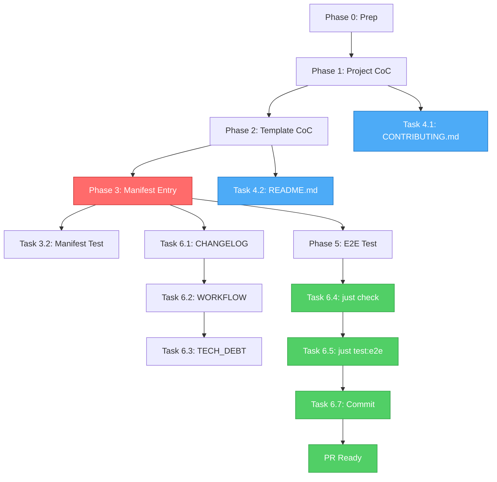

# FEV-15 Todo List — Community Standards (v1.2 Phase 5)

**Phase:** FEV-15 (v1.2 Phase 5) — 📋 Pendiente
**Issue:** [#55](https://github.com/fisherk2/codice-opencode/issues/55) — Añadir código de conducta
**Spec:** [SPEC.md](../SPEC.md), [docs/WORKFLOW.md](../docs/WORKFLOW.md) §FEV-15, [docs/diagnosis/fix08-v1.2-phase5-community.md](../docs/diagnosis/fix08-v1.2-phase5-community.md)
**Date:** 2026-07-30
**Full plan:** [plan.md](./plan.md)
**Status:** 📋 Pendiente — ready to start Phase 0
**Branch base:** `develop` (FEV-14 ya mergeado)

---

## Decisiones Confirmadas (vía question tool, 2026-07-30)

| # | Pregunta | Decisión |
|---|----------|----------|
| 1 | Alcance del plan | **Completo (8 tareas)** — incluye `FileRuleManifestData.ts` (CRÍTICO para entrega del template CoC) |
| 2 | Wiki mentions | **Omitir** — sin menciones en `Home.md` / `Getting-Started.md`; cobertura transitiva desde README/CONTRIBUTING |
| 3 | Test E2E | **Extender `01-clean-install.sh`** existente con 2 asserts (no scenario nuevo) |
| 4 | Versión | **Mantener v1.2.0** — sin bump; cierre coordinado FEV-12 ✅ + 13 ✅ + 14 ✅ + 15 |

---

## Phase 0: Preparation

- [ ] **Task 0.1:** Crear rama `feat/fev15-community` desde `develop` — `git checkout -b feat/fev15-community develop`
- [ ] **Task 0.2:** Verificar baseline — `just check` + `just test` + `just test:e2e` exit 0 (809 tests, 19/19 E2E)

**Checkpoint:** ✅ Branch clean, 809 tests passing, 19/19 E2E

---

## Phase 1: Project Code of Conduct

- [ ] **Task 1.1:** Crear `CODE_OF_CONDUCT.md` (Contributor Covenant v2.1, contact `dev@fisherk2.com`, ~140 líneas) → `CODE_OF_CONDUCT.md` (nuevo)

**Checkpoint:** ✅ Project CoC existe, basado en v2.1, sin placeholders

---

## Phase 2: Template Code of Conduct

- [ ] **Task 2.1:** Crear `template/estandar/CODE_OF_CONDUCT.md` (placeholder con `[PROJECT_NAME]`, `[CONTACT_EMAIL]`, `[PROJECT_URL]`, ~120 líneas) → `template/estandar/CODE_OF_CONDUCT.md` (nuevo)

**Checkpoint:** ✅ Template CoC existe, placeholders listos para personalización

---

## Phase 3: FileRuleManifestData Integration (CRITICAL)

- [ ] **Task 3.1:** Agregar entrada `CODE_OF_CONDUCT.md` con `category: "standard"` en `FileRuleManifestData.ts` (después de `CONTRIBUTING.md`, antes de `LICENSE`) → `src/domain/entities/FileRuleManifestData.ts` (+6 líneas)
- [ ] **Task 3.2:** Unit test: manifest incluye `CODE_OF_CONDUCT.md` con `category: "standard"` e `isDirectory: false` → `tests/unit/domain/file-rule-manifest.test.ts` (+15 líneas, o nuevo archivo si no existe)

**Checkpoint:** ✅ Manifest conoce el CoC, unit test pasa, sin regresión

---

## Phase 4: Cross-references (PARALLEL)

- [ ] **Task 4.1:** Agregar `## Code of Conduct` section a `CONTRIBUTING.md` (antes de `## Quick Start`, link a `CODE_OF_CONDUCT.md` + Contributor Covenant v2.1) → `CONTRIBUTING.md` (+5 líneas)
- [ ] **Task 4.2:** Agregar `## Code of Conduct` section a `README.md` (antes de `## License`, menciona project + template CoC) → `README.md` (+10 líneas)

**Checkpoint:** ✅ Ambos docs cross-referencian al CoC, sin broken links

---

## Phase 5: E2E Test

- [ ] **Task 5.1:** Extender `tests/e2e/01-clean-install.sh` con 2 asserts: (1) `CODE_OF_CONDUCT.md` existe en destino, (2) contiene `Our Pledge` → `tests/e2e/01-clean-install.sh` (+2 líneas)

**Checkpoint:** ✅ E2E confirma entrega end-to-end, 19/19 pasan

---

## Phase 6: Documentation & Verification

- [ ] **Task 6.1:** Reemplazar `_No unreleased changes._` en `CHANGELOG.md` con `### Added` (5 bullets) + `### Changed` (1 bullet) entries de FEV-15 → `CHANGELOG.md` (+15 líneas)
- [ ] **Task 6.2:** Marcar FEV-15 `✅ Completo` en `docs/WORKFLOW.md` línea 35 + agregar nueva sección "Fase FEV-15" con resultados (≥810 tests, 2 CoC files, 1 manifest entry) → `docs/WORKFLOW.md` (+20 líneas, <300 total)
- [ ] **Task 6.3:** Mover FEV-15 a "Resolved" en `docs/TECH_DEBT.md` con Issue #55 marcado `✅` → `docs/TECH_DEBT.md` (+8 líneas)
- [ ] **Task 6.4:** `just check` → 0 errors
- [ ] **Task 6.5:** `bun test` → ≥810 tests, 0 fail (809 baseline + 1 new manifest test)
- [ ] **Task 6.6:** `just test:e2e` → 19/19 (1 modified: `01-clean-install.sh` con CoC asserts)
- [ ] **Task 6.7:** Commit con `Co-Authored-By: Moctezuma <dev@fisherk2.com>` trailer (5-6 atomic commits)

**Checkpoint:** ✅ Todos DoD items satisfied, FEV-15 cerrado, v1.2.0 ready

---

## DoD Checklist — FEV-15

### Functional

- [ ] **Issue #55 resuelto** — Code of Conduct existe para project y template
- [ ] **Project `CODE_OF_CONDUCT.md` creado** (Contributor Covenant v2.1, contact: `dev@fisherk2.com`)
- [ ] **Template `CODE_OF_CONDUCT.md` creado** como placeholder personalizable (3 placeholders: `[PROJECT_NAME]`, `[CONTACT_EMAIL]`, `[PROJECT_URL]`)
- [ ] **`FileRuleManifestData.ts` actualizado** con `category: "standard"` (CRÍTICO)
- [ ] **`CONTRIBUTING.md` actualizado** con sección `## Code of Conduct` (antes de `## Quick Start`)
- [ ] **`README.md` actualizado** con sección `## Code of Conduct` (antes de `## License`)
- [ ] **E2E test extendido**: `tests/e2e/01-clean-install.sh` verifica que `CODE_OF_CONDUCT.md` se entrega con contenido `Our Pledge`

### Quality

- [ ] `just check`: 0 errors, 0 warnings
- [ ] `bun test`: ≥810 tests, 0 fail
- [ ] `just test:e2e`: 19/19 scenarios passing
- [ ] Manifest unit test cubre nueva entrada
- [ ] No `any` types introducidos
- [ ] No code changes fuera de docs/manifest/test scope

### Documentation

- [ ] `CHANGELOG.md`: FEV-15 entry bajo `[Unreleased]` (Added + Changed)
- [ ] `docs/WORKFLOW.md`: FEV-15 marcado `✅ Completo` con results section
- [ ] `docs/TECH_DEBT.md`: FEV-15 row movido a "Resolved" subsection
- [ ] No broken internal links
- [ ] No `template/obligatorio/CODE_OF_CONDUCT.md` (intencional — CoC es personalizable)

### Process

- [ ] 5-6 atomic commits siguiendo Conventional Commits
- [ ] Todos los commits con `Co-Authored-By: Moctezuma <dev@fisherk2.com>` trailer
- [ ] Branch `feat/fev15-community` desde `develop`
- [ ] No version bump (v1.2.0 cierra con FEV-12/13/14/15 coordinado)

---

## Resumen de Archivos a Modificar/Crear

### Nuevos archivos (2)

1. `CODE_OF_CONDUCT.md` (~140 líneas) — Project CoC, Contributor Covenant v2.1
2. `template/estandar/CODE_OF_CONDUCT.md` (~120 líneas) — Template CoC, placeholder personalizable

### Archivos modificados (8)

1. `src/domain/entities/FileRuleManifestData.ts` (+6 líneas) — Manifest entry
2. `tests/unit/domain/file-rule-manifest.test.ts` (+15 líneas) — Unit test
3. `CONTRIBUTING.md` (+5 líneas) — `## Code of Conduct` section
4. `README.md` (+10 líneas) — `## Code of Conduct` section
5. `tests/e2e/01-clean-install.sh` (+2 líneas) — E2E asserts
6. `CHANGELOG.md` (+15 líneas) — FEV-15 entry
7. `docs/WORKFLOW.md` (+20 líneas) — FEV-15 complete + results
8. `docs/TECH_DEBT.md` (+8 líneas) — FEV-15 Resolved

**Total:** 10 archivos (2 nuevos + 8 modificados), ~141 líneas añadidas

### Archivos NO tocados (intencional)

- `template/obligatorio/` — CoC NO es obligatorio (preserva customización del usuario)
- `template/opcional/` — CoC no es item de checklist
- Wiki pages — Omitido por decisión del usuario
- `src/` beyond `FileRuleManifestData.ts` — Sin cambios de lógica de código
- `src/cli/`, `src/infrastructure/`, `src/application/` — Out of scope (CoC es solo docs)

---

## Métricas Esperadas

| Métrica | Baseline (post-FEV-14) | Meta FEV-15 | Verificación |
|---------|------------------------|-------------|--------------|
| Tests (pass/fail) | 809 / 0 | ≥810 / 0 | `bun test` |
| E2E scenarios | 19 / 19 | 19 / 19 (1 extended) | `just test:e2e` |
| `just check` errors | 0 | 0 | `just check` |
| Coverage (lines) | ≥96.98% | ≥96.98% (no regression) | `bun test --coverage` |
| Files touched | — | 10 (2 new + 8 modified) | `git diff --stat` |
| Lines added | — | ~141 | `git diff --shortstat` |
| CoC files | 0 | 2 (project + template) | `find . -name "CODE_OF_CONDUCT.md"` |
| Manifest entries (standard) | 17 | 18 | `grep -c "category: \"standard\"" FileRuleManifestData.ts` |
| Issues resolved | — | #55 | GitHub issues |
| Version bump | — | None (v1.2.0 closes coordinated) | `package.json` |

---

## Dependency Graph (Mermaid)

**Critical path:** Phase 0 → 1 → 2 → 3 → 5 → 6 (~2h wall-clock)
**Parallel opportunity:** Tasks 4.1 and 4.2 (CONTRIBUTING.md + README.md) — independientes, pueden dividirse entre dos agentes
**Risk:** Phase 3 (FileRuleManifestData) es el único lugar donde un bug silenciosamente rompería la entrega del template — Task 3.2 + Task 5.1 lo cubren

---

## Próximo Paso

Una vez aprobado el plan:
1. **Phase 0** (preparación) — crear branch, verificar baseline (~5min)
2. **Phase 1-5** (implementación) — secuencial, ~90min
3. **Phase 6** (docs + verificación) — ~25min
4. **Total:** ~2h wall-clock

**Comando sugerido:** `> Run /build to start Phase 0 (preparation)`

---

*Última actualización: 2026-07-30 — Moctezuma (Strategic Planner) — FEV-15 ready to build*

Co-Authored-By: Moctezuma <dev@fisherk2.com>
