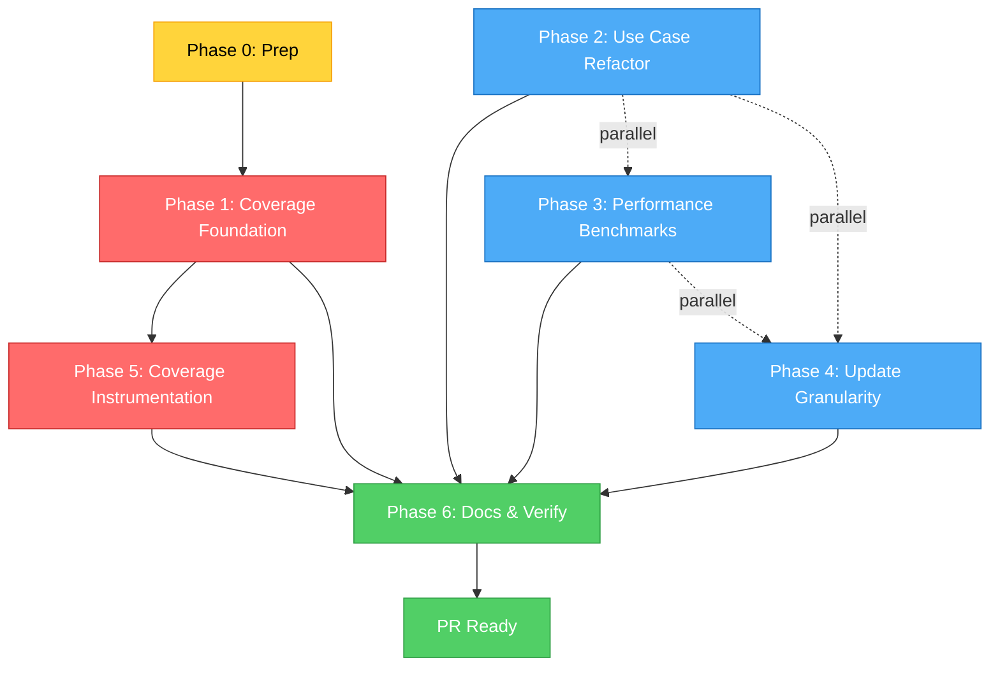

# FEV-16 Todo List — v1.2.0 Pre-release Tech Debt Closure

**Phase:** FEV-16 (v1.2 Phase 6) — 📋 Pendiente
**Scope:** Mega-FEV consolidado (5 items del TECH_DEBT.md sin FEV registrado)
**Spec:** [SPEC.md](../SPEC.md), [docs/WORKFLOW.md](../docs/WORKFLOW.md) §FEV-16, [docs/TECH_DEBT.md](../docs/TECH_DEBT.md)
**Date:** 2026-07-30
**Full plan:** [plan.md](./plan.md)
**Status:** 📋 Pendiente — ready to start Phase 0
**Branch base:** `develop` (FEV-15 ✅ ya mergeado)
**Total effort:** 24h wall-clock (3 días focused, 5-7 días calendario con review)

---

## Decisiones Confirmadas (vía question tool, 2026-07-30)

| # | Pregunta | Decisión |
|---|----------|----------|
| 1 | Agrupación de items | **1 mega FEV-16** (todo en un solo FEV, no split en 4) |
| 2 | Orden de ejecución | **Crítico primero + paralelo donde posible** |
| 3 | Refactor Template Method (TD-2.1) | **Sí, aplicar ahora** (no esperar al cuarto modo) |
| 4 | Diagnosis docs | **No nuevos**; actualizar docs existentes (TECH_DEBT, WORKFLOW) para establecer el scope de FEV-16 |

---

## Items Incluidos (5 items del TECH_DEBT.md)

| ID | Sección | Item | Esfuerzo | Tipo | Workstream |
|----|---------|------|----------|------|------------|
| TD-1.1 | §1.1 | `src/cli/main.ts` coverage (interactive mode) | 2h | Test infrastructure | Phase 1 + Phase 5 |
| TD-2.1 | §2.1 | CleanInstall/ProjectInstall duplicación | 4h | Code refactor (GoF Template Method) | Phase 2 |
| TD-5.1 | §5.1 | E2E Coverage Not Captured | 8h | Test infrastructure | Phase 5 |
| TD-5.2 | §5.2 | No Performance Benchmarks | 4h | Test infrastructure | Phase 3 |
| TD-6.2 | §6.2 | Standard Directory All-or-Nothing | 6h | Domain logic (Strategy extension) | Phase 4 |
| | | **TOTAL** | **24h** | | |

---

## Dependency Order (Critical Path)

```
Phase 0 (Prep, 30min)
    ↓
Phase 1 (Coverage Foundation, 2h) ← BLOCKS Phase 5
    ↓
    ├── Phase 2 (Refactor, 4h) ─┐
    ├── Phase 3 (Benchmarks, 4h) ─┼── parallel
    └── Phase 4 (Granularity, 6h) ─┘
    ↓
Phase 5 (Coverage Instrumentation, 10h) ← depends on Phase 1
    ↓
Phase 6 (Docs & Verify, 1h)
```

**Critical path:** Phase 0 → 1 → 5 → 6 (~13h, longest chain)
**Parallel branches:** Phase 2, 3, 4 (~14h combined if solo, ~4-5h if 3 agents)

---

## Phase 0: Preparation

- [ ] **Task 0.1:** Crear rama `feat/fev16-tech-debt` desde `develop` — `git checkout -b feat/fev16-tech-debt develop`
- [ ] **Task 0.2:** Verificar baseline — `just check` + `just test` + `just test:e2e` exit 0 (810 tests, 19/19 E2E)

**Checkpoint:** ✅ Branch clean, 810 tests passing, 19/19 E2E

---

## Phase 1: Coverage Foundation (CRITICAL — blocks Phase 5)

- [ ] **Task 1.1:** Extraer `resolveInteractiveMode()` de `main.ts` (líneas 134-145) como función exportada — `src/cli/main.ts` (refactor, similar length)
- [ ] **Task 1.2:** Unit tests para `resolveInteractiveMode()` con mock `IUserPrompt` (9 casos) — `tests/unit/cli/main.test.ts` (nuevo, ~80 líneas)

**Checkpoint:** ✅ Function extracted, 9 unit tests pass, main.ts coverage ≥90%

---

## Phase 2: Use Case Refactor [PARALLELIZABLE]

**Pattern:** GoF Template Method

- [ ] **Task 2.1:** Crear `InstallUseCaseBase` abstract class con 3 hooks (`buildRules`, `selectOptionals`, `getSuccessMessage`) — `src/application/use-cases/InstallUseCaseBase.ts` (nuevo, ~90 líneas)
- [ ] **Task 2.2:** Migrar `CleanInstallUseCase` a extender base (constructor delega, `execute()` removido) — `src/application/use-cases/CleanInstallUseCase.ts` (166 → ~60 líneas)
- [ ] **Task 2.3:** Migrar `ProjectInstallUseCase` a extender base (constructor delega, `execute()` removido) — `src/application/use-cases/ProjectInstallUseCase.ts` (147 → ~50 líneas)
- [ ] **Task 2.4:** Verificar duplicación eliminada — `just test` + `just test:e2e` exit 0, líneas netas saved ≥ 100

**Checkpoint:** ✅ Template Method aplicado, 123 líneas eliminadas, sin regresión

---

## Phase 3: Performance Benchmarks [PARALLELIZABLE]

- [ ] **Task 3.1:** Agregar `just bench` recipe con `hyperfine` (3 commands, --warmup 1, --runs 5) — `Justfile` (+25 líneas)
- [ ] **Task 3.2:** Crear `benchmarks/clean-install.bench.sh` (executable) — nuevo (~20 líneas)
- [ ] **Task 3.3:** Crear `benchmarks/project-install.bench.sh` (executable) — nuevo (~20 líneas)
- [ ] **Task 3.4:** Crear `benchmarks/update-workspace.bench.sh` (executable) — nuevo (~20 líneas)
- [ ] **Task 3.5:** Crear `benchmarks/assert-no-regression.sh` (asserts <10% regression para SC-9/10/11) — nuevo (~50 líneas)

**Checkpoint:** ✅ 3 benchmarks ejecutables, regression script funcional, baseline capturado

---

## Phase 4: Update Granularity [PARALLELIZABLE]

**Pattern:** Strategy (existing pattern) — 4th strategy para Estándar-Update

- [ ] **Task 4.1:** Crear `diffTrees()` pure function en domain services — `src/domain/services/treeDiff.ts` (nuevo, ~40 líneas)
- [ ] **Task 4.2:** Refactor `FileMergeEngine.shouldStage()` para usar tree-level diff en update mode — `src/domain/services/FileMergeEngine.ts` (+20 líneas)
- [ ] **Task 4.3:** Unit tests para tree-level diff behavior (6+ casos) — `tests/unit/domain/services/file-merge-engine-update.test.ts` (nuevo, ~120 líneas)
- [ ] **Task 4.4:** Integration tests con real temp directories (3+ casos) — `tests/integration/use-cases/update-granularity.test.ts` (nuevo, ~100 líneas)
- [ ] **Task 4.5:** E2E test 16: update entrega new standard file (con `tests/fixtures/template/`) — `tests/e2e/16-update-granularity.sh` (nuevo, ~50 líneas) + `tests/fixtures/template/` (nuevo dir) + `tests/e2e/run-e2e.sh` (+1 línea)

**Checkpoint:** ✅ Tree diff funciona, 6+3+1 tests pass, 20/20 E2E

---

## Phase 5: Coverage Instrumentation [SEQUENTIAL, depends on Phase 1]

- [ ] **Task 5.1:** Agregar `c8` devDep + `scripts/coverage-e2e.sh` wrapper — `package.json` (+1 dep) + `scripts/coverage-e2e.sh` (nuevo, ~10 líneas)
- [ ] **Task 5.2:** Generar E2E coverage report (lcov format) — `bash scripts/coverage-e2e.sh` + `coverage/lcov.info` (nuevo)
- [ ] **Task 5.3:** Agregar coverage gate a CI workflow (≥95% lines, ≥95% functions) — `.github/workflows/ci.yml` (+5 líneas)
- [ ] **Task 5.4:** Verificar main.ts coverage 86.21% → ≥95% (con E2E instrumentation)

**Checkpoint:** ✅ c8 integrado, E2E coverage captured, CI enforces ≥95%, main.ts ≥95%

---

## Phase 6: Documentation & Verification

- [ ] **Task 6.1:** Reemplazar `_No unreleased changes._` en `CHANGELOG.md` con FEV-16 entries (Added + Changed + Fixed) → `CHANGELOG.md` (+25 líneas)
- [ ] **Task 6.2:** Marcar FEV-16 `✅ Completo` en `docs/WORKFLOW.md` + nueva sección "Fase FEV-16" con resultados (≥825 tests, 20/20 E2E, ≥95% coverage, 5 items closed) → `docs/WORKFLOW.md` (+30 líneas, <300 total)
- [ ] **Task 6.3:** Mover 5 FEV-16 items a "Resolved" en `docs/TECH_DEBT.md` (TD-1.1, 2.1, 5.1, 5.2, 6.2 con `✅` resolution) + remover 3 del v1.2.0 summary table → `docs/TECH_DEBT.md` (+12 líneas, -3 líneas)
- [ ] **Task 6.4:** `just check` → 0 errors
- [ ] **Task 6.5:** `bun test` → ≥825 tests, 0 fail (810 baseline + 9 from 1.2 + 6 from 4.3 = 825; verify actual count)
- [ ] **Task 6.6:** `just test:e2e` → 20/20 (19 baseline + 1 new: 16-update-granularity.sh)
- [ ] **Task 6.7:** `just bench` → 3 benchmarks, no regressions >10%
- [ ] **Task 6.8:** Commit con `Co-Authored-By: Moctezuma <dev@fisherk2.com>` trailer (5-7 atomic commits)

**Checkpoint:** ✅ Todos DoD items satisfied, FEV-16 cerrado, v1.2.0 ready for pre-release

---

## DoD Checklist — FEV-16

### Functional

- [ ] **TD-1.1 resuelto** — `resolveInteractiveMode()` extracted + 9 unit tests, main.ts coverage ≥95%
- [ ] **TD-2.1 resuelto** — Template Method pattern applied, ~123 lines duplication eliminated
- [ ] **TD-5.1 resuelto** — `c8` integrated for E2E coverage, CI enforces ≥95% thresholds
- [ ] **TD-5.2 resuelto** — `just bench` + 3 scripts + regression assertion, SC-9/10/11 benchmarked
- [ ] **TD-6.2 resuelto** — Tree-level diff delivers new standard files, existing files preserved

### Quality

- [ ] `just check`: 0 errors, 0 warnings
- [ ] `bun test`: ≥825 tests, 0 fail
- [ ] `just test:e2e`: 20/20 scenarios passing
- [ ] `just bench`: 3 benchmarks captured, no regressions >10%
- [ ] Coverage: lines ≥95%, functions ≥95% (enforced in CI)
- [ ] No `any` types introduced
- [ ] Net code change: ~-100 lines (refactor reduces more than new code adds)

### Documentation

- [ ] `CHANGELOG.md`: FEV-16 entry under `[Unreleased]` (Added + Changed + Fixed)
- [ ] `docs/WORKFLOW.md`: FEV-16 marked `✅ Completo` with results section
- [ ] `docs/TECH_DEBT.md`: 5 items moved to "Resolved" subsection
- [ ] No new diagnosis docs (per user decision)
- [ ] No broken internal links

### Process

- [ ] 5-7 atomic commits following Conventional Commits
- [ ] All commits include `Co-Authored-By: Moctezuma <dev@fisherk2.com>` trailer
- [ ] Branch `feat/fev16-tech-debt` from `develop`
- [ ] No version bump (v1.2.0 closes coordinated with FEV-11/12/13/14/15/16)

---

## Resumen de Archivos a Modificar/Crear

### Nuevos archivos (13)

1. `src/application/use-cases/InstallUseCaseBase.ts` (~90 líneas) — Template Method base class
2. `src/domain/services/treeDiff.ts` (~40 líneas) — Tree-level diff pure function
3. `tests/unit/cli/main.test.ts` (~80 líneas) — Unit tests for resolveInteractiveMode
4. `tests/unit/domain/services/file-merge-engine-update.test.ts` (~120 líneas) — Unit tests for tree-level diff
5. `tests/integration/use-cases/update-granularity.test.ts` (~100 líneas) — Integration tests for update mode
6. `tests/e2e/16-update-granularity.sh` (~50 líneas) — E2E scenario for new standard file delivery
7. `tests/fixtures/template/` (directorio) — Test template for E2E
8. `scripts/coverage-e2e.sh` (~10 líneas) — E2E coverage wrapper
9. `benchmarks/clean-install.bench.sh` (~20 líneas) — Clean Install benchmark
10. `benchmarks/project-install.bench.sh` (~20 líneas) — Project Install benchmark
11. `benchmarks/update-workspace.bench.sh` (~20 líneas) — Update Workspace benchmark
12. `benchmarks/assert-no-regression.sh` (~50 líneas) — Regression assertion
13. `benchmarks/baseline.json` (generado) — Baseline benchmark times

**Total:** 13 nuevos archivos, ~600 líneas

### Archivos modificados (11)

1. `src/cli/main.ts` (refactor, similar length) — Extract `resolveInteractiveMode()`
2. `src/application/use-cases/CleanInstallUseCase.ts` (166 → ~60 líneas) — Extend base
3. `src/application/use-cases/ProjectInstallUseCase.ts` (147 → ~50 líneas) — Extend base
4. `src/domain/services/FileMergeEngine.ts` (+20 líneas) — Tree-level diff integration
5. `Justfile` (+25 líneas) — `just bench` recipe
6. `package.json` (+1 dep) — `c8` devDependency
7. `tests/e2e/run-e2e.sh` (+1 línea) — Include scenario 16
8. `.github/workflows/ci.yml` (+5 líneas) — Coverage threshold gate
9. `CHANGELOG.md` (+25 líneas) — FEV-16 entry
10. `docs/WORKFLOW.md` (+30 líneas) — FEV-16 complete
11. `docs/TECH_DEBT.md` (+12 líneas, -3 líneas) — 5 items to Resolved

**Total:** 11 archivos modificados, net change ~-100 líneas

### Archivos NO tocados (intencional)

- `template/` — Sin cambios en el template
- `src/domain/entities/` — Manifest sin cambios
- `src/infrastructure/` — Sin cambios en adapters
- `specs/` — Sin cambios en specs
- Wiki pages — Actualizados transitivamente desde CHANGELOG/WORKFLOW/TECH_DEBT
- `src/application/use-cases/UpdateWorkspaceUseCase.ts` — Diferentes semánticas, no es Template Method subclass

---

## Métricas Esperadas

| Métrica | Baseline (post-FEV-15) | Meta FEV-16 | Verificación |
|---------|------------------------|-------------|--------------|
| Tests (pass/fail) | 810 / 0 | ≥825 / 0 | `bun test` |
| E2E scenarios | 19 / 19 | 20 / 20 | `just test:e2e` |
| `just check` errors | 0 | 0 | `just check` |
| Coverage (lines) | 96.98% | ≥95% (enforced) | `bun test --coverage` + `c8` |
| Coverage (functions) | 100% | ≥95% (enforced) | `bun test --coverage` + `c8` |
| Files touched | — | 24 (13 new + 11 modified) | `git diff --stat` |
| Lines added | — | ~600 (new) + ~150 (modified) | `git diff --shortstat` |
| Net code change | — | ~-100 líneas (refactor saves more) | `git diff --shortstat` |
| TECH_DEBT items closed | — | 5 (TD-1.1, 2.1, 5.1, 5.2, 6.2) | `docs/TECH_DEBT.md` |
| Performance benchmarks | 0 | 3 + 1 regression | `just bench` |
| Use case lines (Clean+Project) | 313 | ~190 | `wc -l src/application/use-cases/CleanInstallUseCase.ts ProjectInstallUseCase.ts` |
| Issues resolved | — | 0 (TECH_DEBT items, no GitHub issues) | TECH_DEBT.md |
| Version bump | — | None (v1.2.0 closes coordinated) | `package.json` |

---

## Dependency Graph (Mermaid)



**Critical path:** Phase 0 → 1 → 5 → 6 (~13h)
**Parallel opportunity:** Phase 2, 3, 4 — independientes entre sí, pueden dividirse entre 3 agentes (o secuencial para solo contributor)
**Risk:** Phase 1 → Phase 5 es la única cadena secuencial real; el resto es paralelizable.

---

## Próximo Paso

Una vez aprobado el plan:
1. **Phase 0** (preparación) — crear branch, verificar baseline (~30min)
2. **Phase 1** (coverage foundation) — 2h (bloquea Phase 5)
3. **Phase 2-4** (refactor + benchmarks + granularity) — 14h (paralelo entre sí)
4. **Phase 5** (coverage instrumentation) — 10h (depende de Phase 1)
5. **Phase 6** (docs + verificación) — 1h
6. **Total:** ~24h wall-clock, 5-7 días calendario con review cycles

**Comando sugerido:** `> Run /build to start Phase 0 (preparation)`

---

*Última actualización: 2026-07-30 — Moctezuma (Strategic Planner) — FEV-16 ready to build*

Co-Authored-By: Moctezuma <dev@fisherk2.com>
