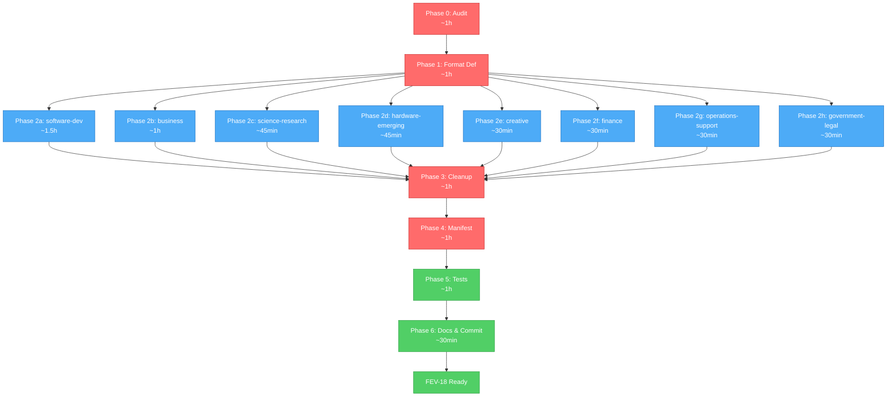

# FEV-18 Todo List — Agent Classification & Migration (v2.0 Phase 2)

**Phase:** FEV-18 (v2.0 Phase 2) — 🔲 Planificado (2026-08-04)
**Scope:** Clasificar y migrar agentes desde `agency-agents-main/` (267) + `packs/sin-clasificar/` (95) a los 8 packs. Formatear 267 nuevos a YAML v2.0 + COMPOSITION. Actualizar `FileRuleManifestData`. NO installer UX (FEV-21).
**Spec:** [specs/spec-agent-packs.md §3](../specs/spec-agent-packs.md), [ADR-014](../specs/adr/adr-014-agent-pack-system.md), [docs/WORKFLOW.md §FEV-18](../docs/WORKFLOW.md)
**Date:** 2026-08-04
**Full plan:** [plan.md](./plan.md)
**Branch:** `feat/new-agents` (FEV-17 ✅ completado; `agency-agents-main/` untracked)
**Total effort:** ~8–10h wall-clock (3-4 días calendario con review)

---

## Decisiones Confirmadas (vía question tool, 2026-08-04)

| # | Pregunta | Decisión |
|---|----------|----------|
| 1 | Format strategy | **Hybrid** — reformatear los 267 nuevos al estándar YAML v2.0 + `## COMPOSITION`; los 95 sin-clasificar (legacy v1.x) NO se reformatean |
| 2 | Source discrepancy (267 vs 345) | **Audit then plan** — Phase 0 reconcilia los números reales |
| 3 | sin-clasificar fate | **Distribute to packs** — cada uno de los 95 va a su pack correspondiente (algunos IMPROVABLE/REDUNDANT) |
| 4 | scientific-literature-researcher location | **MOVER de `packs/writers/` a `packs/science-research/`** — es un agente de análisis científico, no de escritura. Writers queda con 2: `docs-writer`, `obsidian-vault-writer` |

---

## Inventory Snapshot (pre-audit, 2026-08-04)

| Fuente | Count | Notas |
|--------|-------|-------|
| `agency-agents-main/` (17 categorías) | 267 .md files | Nuevos v2.0 — fuente principal |
| `packs/sin-clasificar/` (legacy v1.x) | 95 .md files | A distribuir entre 8 packs |
| **REDUNDANT** (colisiones de nombre) | 10 names | Legacy wins (backward compat) |
| **Solo en sin-clasificar** (no en agency-agents) | 85 names | Pure legacy v1.x |
| **Solo en agency-agents** (nuevos puros) | 257 names | Pure v2.0 additions |
| **Total final esperado** | ~302-362 unique | Depende de IMPROVABLE merges (post-audit) |

**Top 10 REDUNDANT (same name in both):**
`ai-engineer`, `data-engineer`, `database-optimizer`, `frontend-developer`, `network-engineer`, `product-manager`, `prompt-engineer`, `sales-engineer`, `sre-engineer`, `ux-researcher`

---

## Dependency Order (Critical Path)

```
Phase 0 (Audit, 1h, sequential, BLOQUEA todo)
    ↓
Phase 1 (Format Definition, 1h, critical path)
    ↓
    ├── Phase 2 (Pack Distribution, 5h) ─┐
    │       ├── software-development (1.5h, biggest)    │
    │       ├── business (1h)                            │
    │       ├── science-research (45min)                 │── parallel
    │       ├── hardware-emerging (45min)               │   possible
    │       ├── creative (30min)                         │
    │       ├── finance (30min)                          │
    │       ├── operations-support (30min)               │
    │       └── government-legal (30min)                 │
    ↓                                                 ↓
Phase 3 (sin-clasificar Cleanup, 1h, sequential)
    ↓
Phase 4 (Manifest & Catalog, 1h, sequential)
    ↓
Phase 5 (Tests & Verification, 1h, sequential, gates Phase 6)
    ↓
Phase 6 (Documentation & Commit, 30min)
```

**Critical path:** Phase 0 → 1 → 2a → 3 → 4 → 5 → 6 (~7h)
**Parallel branches in Phase 2:** 7 packs (~3.5h combined if parallel)

---

## Phase 0: Audit & Inventory (CRITICAL — gates all)

- [ ] **Task 0.1:** Generar inventario completo de `agency-agents-main/` (267 files, 17 categorías) → `tasks/audit-fev-18-inventory.md`
- [ ] **Task 0.2:** Calcular overlap sin-clasificar (95) vs agency-agents-main (267) → 10 REDUNDANT identificados
- [ ] **Task 0.3:** Determinar pack assignment para cada IDEAL agent (≥247) y cada sin-clasificar (95) → `tasks/audit-fev-18-pack-assignment.md`
- [ ] **Task 0.4:** Generar audit summary report → `tasks/audit-fev-18-summary.md` con counts por pack

**Checkpoint:** ✅ 4 audit files generados, counts por pack confirmados, REDUNDANT list confirmada — **Review con humano antes de Phase 1**

---

## Phase 1: Format Definition (CRITICAL — gates Phase 2+)

- [ ] **Task 1.1:** Definir YAML frontmatter v2.0 standard (description, mode: subagent, permission) → `docs/AGENT-FORMAT-V2.md`
- [ ] **Task 1.2:** Definir `## COMPOSITION` block format (Invoke via, Knowledge, RULES) → extender `docs/AGENT-FORMAT-V2.md`
- [ ] **Task 1.3:** Crear `scripts/reformat-agent.ts` (idempotente, con `--dry-run` flag) — input: agency-agents file, output: pack file con v2.0 format
- [ ] **Task 1.4:** Dry-run reformat en 5 sample agents (1 por categoría principal) → validar output
- [ ] **Pre-Phase 2 step:** Mover `template/obligatorio/packs/writers/scientific-literature-researcher.md` a `template/obligatorio/packs/science-research/` (decisión usuario 2026-08-04)

**Checkpoint:** ✅ Format spec documentado, script funciona, 5 samples OK, scientific-literature-researcher movido — **Review con humano antes de Phase 2**

---

## Phase 2: Pack Distribution (CRITICAL — gates Phase 3+)

> **Vertical slicing per pack.** Cada task = 1 pack completo. Empezar por `software-development` (más grande, ~120 agents). Tasks 2.2-2.8 son paralelizables entre sesiones.

- [ ] **Task 2.1:** `software-development` pack — engineering (subset) + security + testing + sin-clasificar subset = ~120 agents
- [ ] **Task 2.2:** `business` pack — marketing + sales + product + project-management + paid-media + sin-clasificar subset = ~75 agents
- [ ] **Task 2.3:** `science-research` pack — academic + gis + healthcare + specialized (subset) + sin-clasificar subset + `scientific-literature-researcher` (movido de writers/) = ~46 agents
- [ ] **Task 2.4:** `hardware-emerging` pack — engineering (iot/embedded) + game-development + spatial-computing + specialized (subset) + sin-clasificar subset = ~50 agents
- [ ] **Task 2.5:** `creative` pack — design + sin-clasificar subset = ~10 agents
- [ ] **Task 2.6:** `finance` pack — finance + specialized (subset) + sin-clasificar subset = ~15 agents
- [ ] **Task 2.7:** `operations-support` pack — support + specialized (subset) + engineering (subset) + sin-clasificar subset = ~25 agents
- [ ] **Task 2.8:** `government-legal` pack — security (subset) + specialized (subset) + sin-clasificar subset = ~10 agents

**Checkpoint:** ✅ Los 8 packs poblados, total = audit count, 267 nuevos en v2.0 format

---

## Phase 3: sin-clasificar Cleanup (CRITICAL)

- [ ] **Task 3.1:** Verificar `packs/sin-clasificar/` está vacío (todos los 95 distribuidos)
- [ ] **Task 3.2:** `rmdir template/obligatorio/packs/sin-clasificar` — eliminar directorio
- [ ] **Task 3.3:** Remover entry `packs/sin-clasificar` de `src/domain/entities/FileRuleManifestData.ts` (líneas 42-47). Manifest: 4 mandatory → 3 mandatory

**Checkpoint:** ✅ sin-clasificar/ eliminado, manifest con 3 mandatory entries, tests pasan

---

## Phase 4: Manifest & Catalog Updates (CRITICAL — gates tests)

- [ ] **Task 4.1:** Agregar 8 entries de packs seleccionables a `FileRuleManifestData.ts` (3 → 11 mandatory entries). **Update writers/ description:** "2 writer agents (docs-writer, obsidian-vault-writer) — scientific-literature-researcher moved to science-research pack in FEV-18"
- [ ] **Task 4.2:** Actualizar unit tests de manifest — esperar 11 mandatory entries en lugar de 4
- [ ] **Task 4.3:** Expandir Huitzilopochtli's "AVAILABLE SUBAGENTS" catalog (~96 → ~362 subagents, agrupados por pack)

**Checkpoint:** ✅ Manifest con 11 entries, tests pasan, catalog actualizado — `just check` + `just test:unit` exit 0

---

## Phase 5: Tests & Verification (CRITICAL — gates Phase 6)

- [ ] **Task 5.1:** Crear `tests/unit/domain/all-packs-present.test.ts` — verifica 10 pack dirs existen + sin-clasificar NO existe
- [ ] **Task 5.2:** Crear `tests/unit/domain/pack-agent-counts.test.ts` — verifica cada pack tiene el count esperado (±10% tolerance)
- [ ] **Task 5.3:** Extender `tests/e2e/01-clean-install.sh` con assertions de agents de 3+ packs
- [ ] **Task 5.4:** Run full verification — `just check` + `just test` + `just test:e2e` + `bun pm pack --dry-run` (< 5MB)

**Checkpoint:** ✅ ~956 tests pass, 20/20 E2E, coverage ≥95%, tarball < 5MB

---

## Phase 6: Documentation & Commit (SEQUENTIAL, gates FEV-19)

- [ ] **Task 6.1:** Update `CHANGELOG.md` con FEV-18 entry (Added/Changed/Removed)
- [ ] **Task 6.2:** Update `docs/WORKFLOW.md` (FEV-18 status `🔲` → `✅`) + `docs/TECH_DEBT.md`
- [ ] **Task 6.3:** Decidir destino de 4 audit artifacts (commit como histórico o gitignore)
- [ ] **Task 6.4:** 7-11 atomic commits con Conventional Commits + `Co-Authored-By: Moctezuma <dev@fisherk2.com>`:
  1. `chore(tasks): add FEV-18 audit artifacts`
  2. `docs: add agent format v2.0 specification`
  3. `feat(scripts): add reformat-agent.ts for v2.0 agent conversion`
  4. `feat(template): distribute software-development pack (~120 agents)`
  5. `feat(template): distribute business pack (~75 agents)`
  6. `feat(template): distribute 6 remaining packs (science, hardware, creative, finance, ops, gov-legal) ~155 agents`
  7. `refactor(template)!: remove sin-clasificar pack (95 agents distributed to 8 packs)`
  8. `feat(domain): update FileRuleManifestData with 8 selectable packs (v2.0)`
  9. `docs: update Huitzilopochtli's catalog with ~362 subagents`
  10. `test: add pack directory and agent count smoke tests; extend E2E clean-install`
  11. `docs: FEV-18 changelog, workflow, tech debt updates`
- [ ] **Task 6.5:** PR a `develop` con descripción completa (scope, metrics, links a plan.md y spec)

**Checkpoint:** ✅ FEV-18 cerrado, 7-11 commits, PR listo para review, FEV-19 puede comenzar

---

## DoD Checklist — FEV-18

### Funcional

- [ ] Los 8 packs poblados con agents según audit
- [ ] 267 nuevos agents en formato v2.0 (YAML + COMPOSITION)
- [ ] 95 legacy agents distribuidos (no reformateados)
- [ ] 10 REDUNDANT resueltos (legacy wins, new discarded)
- [ ] IMPROVABLE merges aplicados (legacy con bloque `## Additional Context (FEV-18)`)
- [ ] `packs/sin-clasificar/` directorio eliminado
- [ ] `FileRuleManifestData` con 11 mandatory entries (3 + 8 packs)
- [ ] Huitzilopochtli catalog expandido (~96 → ~362)

### Calidad

- [ ] `just check`: 0 errors, 0 warnings nuevos
- [ ] `just test`: ≥956 tests, 0 fail (~10 new tests)
- [ ] `just test:e2e`: 20/20 scenarios (1 extended)
- [ ] Coverage: lines ≥95%, functions ≥95% (enforced)
- [ ] No `any` types introducidos
- [ ] Tarball size < 5MB (SC-15)

### Documentación

- [ ] `docs/AGENT-FORMAT-V2.md` creado
- [ ] `CHANGELOG.md` con entrada FEV-18 (Added/Changed/Removed)
- [ ] `docs/WORKFLOW.md` FEV-18 marcado ✅
- [ ] 4 audit artifacts en `tasks/` (commiteados como histórico)

### Proceso

- [ ] 7-11 atomic commits con Conventional Commits
- [ ] Todos los commits con `Co-Authored-By: Moctezuma <dev@fisherk2.com>` trailer
- [ ] Branch `feat/new-agents` con FEV-18 commits (continúa de FEV-17)
- [ ] PR abierto a `develop`
- [ ] No version bump (v2.0.0 coordina al final con FEV-19 a FEV-23)

---

## Resumen de Archivos a Crear/Modificar

### Nuevos archivos (10+)

**Documentación (5):**
1. `docs/AGENT-FORMAT-V2.md` (~100 lines)
2. `tasks/audit-fev-18-inventory.md` (~270 lines)
3. `tasks/audit-fev-18-classification.md` (~280 lines)
4. `tasks/audit-fev-18-pack-assignment.md` (~370 lines)
5. `tasks/audit-fev-18-summary.md` (~150 lines)

**Scripts (1):**
6. `scripts/reformat-agent.ts` (~80 lines)

**Tests (2-3):**
7. `tests/unit/domain/all-packs-present.test.ts` (~50 lines)
8. `tests/unit/domain/pack-agent-counts.test.ts` (~60 lines)
9. `tests/unit/infrastructure/template-resolver.test.ts` (extended, if needed)

**Agents (267 reformateados + 95 movidos):**
10-17. `template/obligatorio/packs/{software-development,business,science-research,hardware-emerging,creative,finance,operations-support,government-legal}/*.md` (~362 files)

### Archivos modificados (5)

**Code (1):**
18. `src/domain/entities/FileRuleManifestData.ts` (+~50 lines net, -6 sin-clasificar)

**Tests (3):**
19. `tests/unit/domain/file-rule-manifest.test.ts` (~20 lines)
20. `tests/unit/file-rule-manifest.test.ts` (~20 lines, if exists)
21. `tests/e2e/01-clean-install.sh` (+~20 lines)

**Agents (1):**
22. `template/obligatorio/packs/main/huitzilopochtli.md` (+~50 lines, catalog)

### Directorios eliminados (1)

23. `template/obligatorio/packs/sin-clasificar/` (rmdir)

### Documentación actualizada (3)

24. `CHANGELOG.md` (+~25 lines)
25. `docs/WORKFLOW.md` (~10 lines)
26. `docs/TECH_DEBT.md` (~5 lines, if applicable)

---

## Métricas Esperadas

| Métrica | Baseline (post-FEV-17) | Meta FEV-18 | Verificación |
|---------|------------------------|-------------|--------------|
| Tests (pass/fail) | 946 / 0 | ≥956 / 0 (+~10 new) | `just test` |
| E2E scenarios | 20 / 20 | 20 / 20 (1 extended) | `just test:e2e` |
| `just check` errors | 0 | 0 | `just check` |
| Coverage (lines) | 98.10% | ≥95% (enforced) | `bun test --coverage` |
| Mandatory rules | 4 | 11 (3 + 8 packs) | `grep "category: \"mandatory\""` |
| Total agents | 104 (in 4 dirs) | ~361 (in 10 dirs) | `find template -name "*.md" -path "*/packs/*" \| wc -l` |
| Writers agents | 3 | 2 (scientific-literature-researcher → science-research) | `ls packs/writers/ \| wc -l` |
| Packs populated | 4 (2 mandatory + 1 tmp + 8 empty) | 10 (2 mandatory + 8 selectable) | `ls packs/ \| wc -l` |
| `packs/sin-clasificar/` exists | yes | no | `ls packs/sin-clasificar` |
| Files touched | — | ~380 (267 reformatted + 95 moved + 18 new/modified) | `git diff --stat` |
| Atomic commits | — | 7-11 | `git log --oneline develop..HEAD \| wc -l` |
| Wall-clock | — | ~8-10h (vs 8h estimated) | Self-reported |
| Tarball size | < 5MB | < 5MB (verificar) | `bun pm pack --dry-run` |

---

## Dependency Graph (Mermaid)



**Critical path:** Phase 0 → 1 → 2a → 3 → 4 → 5 → 6 (~7h)
**Parallel branches in Phase 2:** 7 packs after software-development (~3.5h combined)

---

## Open Questions (requieren decisión humana)

1. **`agency-agents-main/` post-FEV-18:** ¿Mantenemos untracked, commitear como `_archive/agency-agents-source/`, o eliminar? Default propuesto: commitear en `template/_archive/` con `.gitignore` para distribución.
2. **Source commit SHA:** El bloque `Knowledge` en COMPOSITION debería referenciar el SHA del commit original. Si no se tiene, usar fecha de FEV-18.
3. **Pack boundaries post-FEV-21:** Single-pack-per-agent puede sentirse restrictivo si usuarios quieren mezclar (e.g., fintech-engineer en finance + software-development). Defer a feedback post-v2.0.0.

---

## Próximo Paso

Una vez aprobado el plan:
1. **Phase 0** (audit) — 4 tasks (~1h, BLOQUEA todo)
2. **Phase 1** (format) — 4 tasks (~1h, critical path)
3. **Phase 2** (pack distribution) — 8 tasks (~5h, biggest first)
4. **Phase 3** (cleanup) — 3 tasks (~1h)
5. **Phase 4** (manifest) — 3 tasks (~1h)
6. **Phase 5** (tests) — 4 tasks (~1h, gates commits)
7. **Phase 6** (commit + PR) — 5 tasks (~30min)
8. **Total:** ~10h wall-clock, 3-4 días calendario con review cycles

**Comando sugerido:** `> Run /build to start Phase 0 (audit & inventory)`

---

*Última actualización: 2026-08-04 — Moctezuma (Strategic Planner) — FEV-18 plan ready for human review*

Co-Authored-By: Moctezuma <dev@fisherk2.com>
