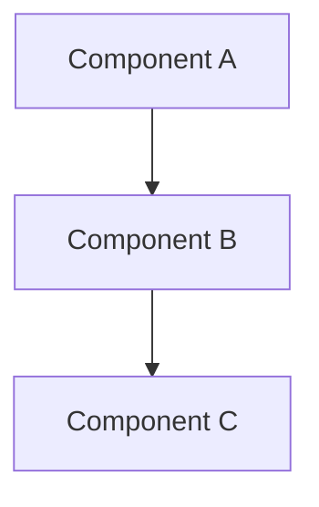

# Architecture — [Project Name]

> Executive index of architectural decisions. Each significant choice is recorded
> as an ADR in `specs/adr/` following the [MADR](https://adr.github.io/) format.

## Decision Index

| ADR | Title | Status | Date |
|-----|-------|--------|------|
| [ADR-001](../specs/adr/adr-001-template.md) | [Decision title] | Accepted | YYYY-MM-DD |
| [ADR-002](../specs/adr/adr-002-template.md) | [Decision title] | Proposed | YYYY-MM-DD |

## Architecture Overview

<!-- Brief description of the system architecture. Include: -->
<!-- - High-level component diagram (consider Mermaid for GitHub/GitLab compatibility) -->
<!-- - Key technology choices and rationale -->
<!-- - Layer boundaries and dependency rules -->

## Key Decisions Summary

<!-- Summarize the most impactful decisions that shape the codebase: -->

1. **[Decision Title]** (ADR-001) — Brief rationale
2. **[Decision Title]** (ADR-002) — Brief rationale

## References

- [MADR GitHub](https://adr.github.io/) — Architecture Decision Records
- [C4 Model](https://c4model.com/) — Architecture diagrams
- [ADR Tools](https://github.com/joelparkerhenderson/architecture-decision-record) — ADR examples and tools
